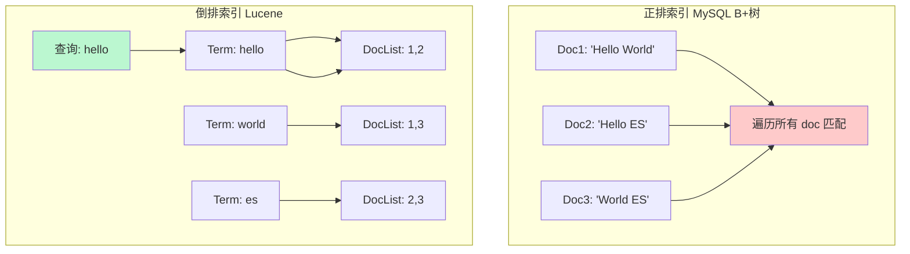
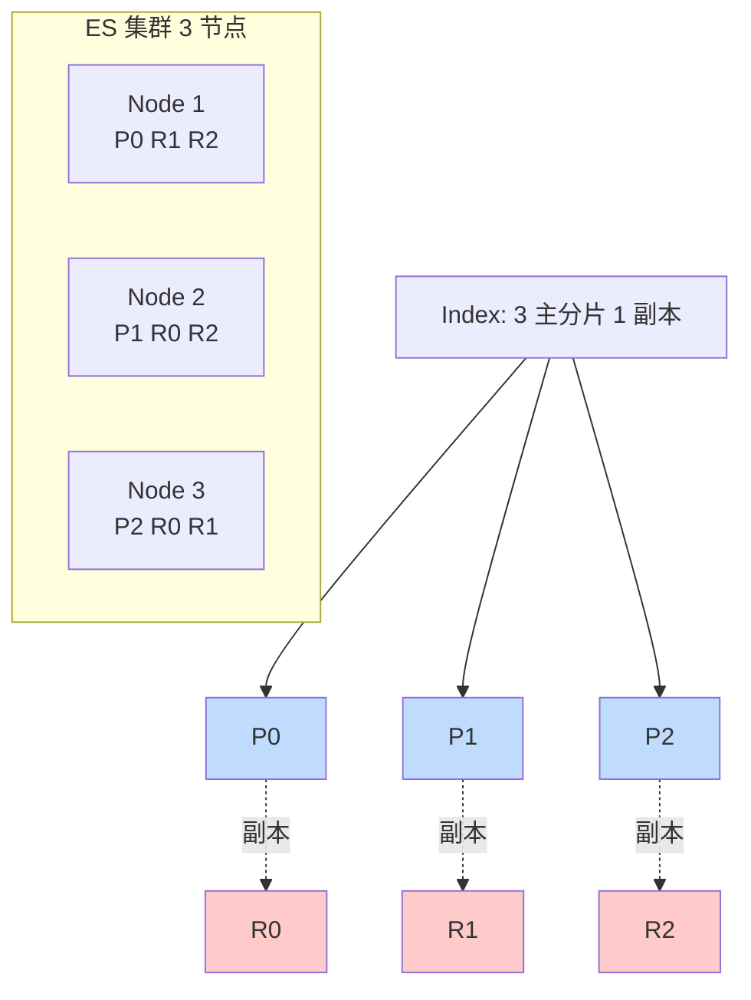
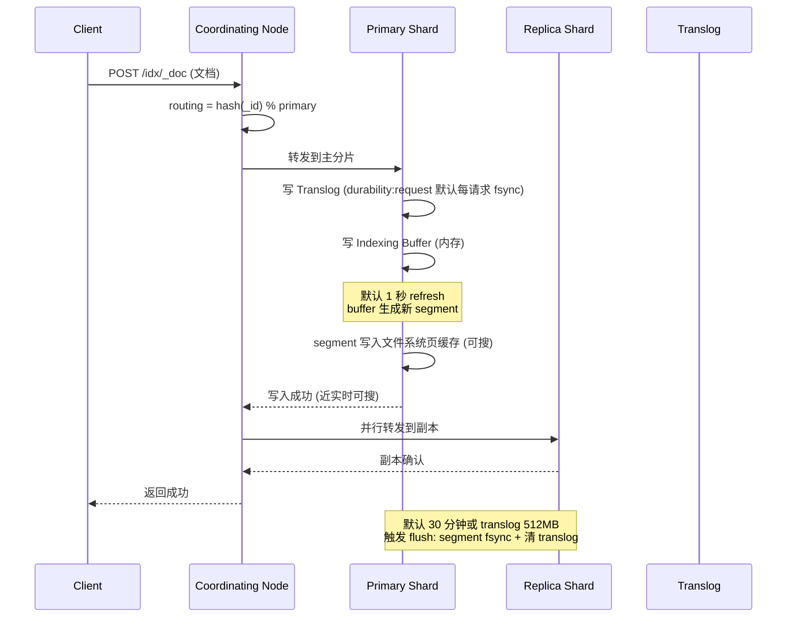

# 数据库 Elasticsearch · 面经

## 核心问题
1. ES 的倒排索引原理是什么？为什么比 MySQL B+ 树更适合全文搜索？
2. ES 集群的分片、副本、路由怎么工作？集群状态红黄绿分别意味着什么、怎么排查？
3. ES 写入流程和近实时搜索原理是什么？refresh / flush / merge 各做什么？

## 答题要点

### 倒排索引原理

ES 基于 Lucene，核心数据结构是**倒排索引**（Inverted Index）。正排索引是"文档 → 关键词"，倒排索引是"关键词 → 文档列表"，全文搜索时无需扫描全表，直接按词定位。

一个 Lucene index（分片的核心）由多个 segment 组成，每个 segment 是不可变的倒排索引。倒排索引包含三部分：
- **Term Dictionary**（词典）：所有去重词项，排序存储，二分查找定位。
- **Term Index**（词典索引）：FST（Finite State Transducer）压缩的词典索引，常驻内存，快速定位 Term 在词典中的位置。
- **Posting List**（倒排表）：每个 Term 对应的文档 ID 列表，用 Roaring Bitmap 压缩，支持高效的 AND/OR/NOT 集合运算。

**为什么比 B+ 树更适合全文搜索**：
| 维度 | MySQL B+ 树 | ES 倒排索引 |
|------|------------|------------|
| 查询方式 | LIKE '%xxx%' 全表扫描 | 按 Term 直接定位，O(1)~O(logN) |
| 分词 | 不支持 | 支持（analyzer 分词后建索引） |
| 相关性排序 | 不支持 | TF-IDF / BM25 打分 |
| 多词组合 | 低效（需多次扫描） | Posting List 交集运算高效 |
| 模糊匹配 | LIKE 性能差 | 支持 prefix/wildcard/fuzzy |
| 适合场景 | 等值/范围查询、事务 | 全文检索、聚合分析 |

注意：ES 不是"万能替代 MySQL"，等值查询、强事务、JOIN 关系，MySQL 仍然更优。生产常见 MySQL（存结构化业务数据）+ ES（存检索冗余）双写，按 CQRS 思路分离读写。

### 分片、副本与路由

- **分片（Shard）**：水平拆分单元，每个分片是一个独立 Lucene index。主分片数建索引时确定，**后续不可改**（需 reindex），副本数可动态调整。
- **主分片（Primary）**：负责写入，一个分片只有一个主。
- **副本分片（Replica）**：主分片的拷贝，提供读负载均衡与高可用；主挂了副本提升为主。
- **路由（Routing）**：`shard = hash(routing) % number_of_primary_shards`，默认 routing 是文档 `_id`。这意味着主分片数一旦确定不能改，否则路由变化导致数据找不到。

**分片数规划经验**：
- 单分片建议 10-50GB，过大影响恢复与查询，过小元数据膨胀。
- 分片数 = 预估数据量 / 50GB，向上取整，留 30% 余量。
- 按时间分索引（daily/monthly）是常见做法，便于生命周期管理（ILM）冷热分离与删除。

### 集群状态红黄绿

| 状态 | 含义 | 影响 | 排查 |
|------|------|------|------|
| Green | 所有主分片和副本均分配 | 无 | - |
| Yellow | 主分片全部分配，部分副本未分配 | 读写正常，单点风险 | `GET _cluster/allocation/explain` 看副本未分配原因 |
| Red | 部分主分片未分配 | 对应索引读写失败 | `GET _cluster/health?level=indices` 定位问题索引，`_cat/shards?v` 找 UNASSIGNED 分片 |

**常见 Red/Yellow 原因**：
- 节点宕机：副本不足，等节点恢复或加节点。
- 磁盘满：`cluster.routing.allocation.disk.watermark.low/high`（默认 85%/90%），超 high 不再分配新分片。
- 分片数超限：`cluster.max_shards_per_node`（默认 1000）。
- 节点属性不匹配：`index.routing.allocation.require.xxx` 约束无法满足。

### 写入流程与近实时原理

**三阶段区别**：
- **refresh**（默认 1 秒）：Indexing Buffer 生成新 segment 并写入文件系统 page cache，**不 fsync**。完成后数据可被搜索，这是"近实时"（NRT）的来源。可调 `index.refresh_interval` 增大提升写入吞吐（批量导入设 -1 关闭）。
- **flush**（默认 30 分钟或 translog 512MB）：segment 持久化 fsync 到磁盘 + 清空 translog + 写新 segment。是真正的"持久化"，崩溃不丢。
- **merge**（后台）：多个小 segment 合并成大 segment，减少段数量提升查询性能，物理删除已标记删除的文档。`index.number_of_segments` 越小查询越快，force_merge 可手动触发（但 IO 重，生产慎用）。

**Translog 的作用**：refresh 只写到 page cache，崩溃会丢；translog 记录所有未 flush 的写操作，崩溃恢复时重放。`index.translog.durability`：
- `request`（默认）：每个写请求 fsync translog，最安全但最慢。
- `async`：按 `sync_interval`（默认 5s）批量 fsync，快但崩溃丢 5 秒数据，适合日志等容忍丢失的场景。

**写入性能优化清单**：
1. 批量写：`bulk` API，单批 5-15MB，并行多线程。
2. 调大 `refresh_interval`（如 30s）减少 segment 生成频率。
3. 关闭 `index.translog.durability: async` 换吞吐（容忍丢几秒）。
4. 副本数先设 0，导入完再调回（导入期间无副本开销）。
5. 关闭无需排序字段的 `_source` 或用 `doc_values: false`（聚合字段才需要）。

## 加分回答

ES 的"近实时"是它和传统数据库最大的体验差异，也是性能调优的核心战场。很多人误以为 refresh_interval 越小越"实时"越好，其实 1 秒的默认值对写入密集场景是巨大的负担--每秒一次 refresh 意味着每秒生成一个 segment，segment 多了查询要遍历所有段，merge 跟不上导致段数膨胀，查询性能雪崩。生产日志场景建议 `refresh_interval: 30s` 甚至 `1m`，写入吞吐能提升 3-5 倍，查询延迟可控。只有对实时性敏感的业务搜索（如商品搜索）才用默认 1s。判断标准看 `GET _cat/segments/idx?v` 的 segment 数量，单分片超过 50 个 segment 就要警惕，看 merge 是否跟上。

分片数规划是 ES 运维"一锤定音"的决策，改不了（reindex 成本极高）。常见误区是"分片越多并行度越高越好"，其实分片过多有三宗罪：元数据膨胀（master 维护所有分片位置，10 万分片让 master 内存吃紧）、查询扇出（一个查询要 scatter 到所有分片再 gather，分片多网络开销大）、资源浪费（每个分片独立 Lucene 实例有固定开销）。经验：单分片 30-50GB，集群总分片数控制在每节点 1000 以内（`cluster.max_shards_per_node`）。时序数据用 ILM 按天/月滚动建新索引，冷数据迁到冷节点（HDD）甚至冻结（ searchable snapshots），热数据留 SSD，这是降本的关键。一个真实教训：某团队把日志索引设了 100 分片，日均 50GB，一个月后集群 15 万分片，master 频繁 FullGC，最后只能 ILM 删历史数据救急。

## 口播版短文案

ES 核心是倒排索引，正排是文档找关键词，倒排是关键词找文档，Lucene 三件套：Term Dictionary 词典、Term Index 用 FST 压缩常驻内存、Posting List 用 Roaring Bitmap 压缩做集合运算。所以全文搜索 O(1) 定位，MySQL 的 LIKE 是全表扫描，高下立判。但 ES 不替代 MySQL，等值和事务还是 B+ 树强，生产常见 MySQL 加 ES 双写走 CQRS。分片是水平拆分单元，主分片数建索引时定死不能改，因为路由是 hash(id) 取模，改了数据找不到。规划经验单分片 30 到 50G，集群总分片每节点别超 1000。集群状态红黄绿：green 全分配，yellow 副本缺，red 主分片缺。写入三阶段：refresh 1 秒生成 segment 到 page cache 可搜但不 fsync，flush 30 分钟 fsync 加清 translog 真持久化，merge 后台合并小段。写入优化五件套：bulk 批量、refresh_interval 调大、translog async、副本先设 0 导入完调回。

## 标签
Elasticsearch, 倒排索引, 分片路由, 近实时搜索, refresh/flush, ILM, 运维面试
