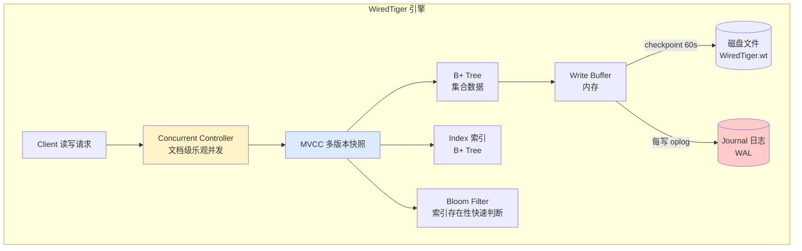
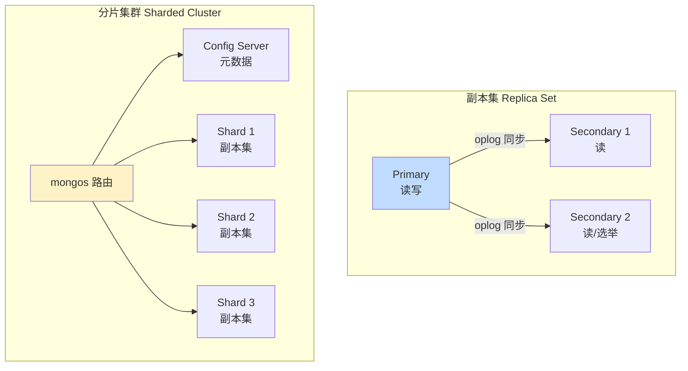

# 数据库 MongoDB · 面经

## 核心问题
1. MongoDB 的存储引擎 WiredTiger 工作原理是什么？为什么适合写多读少场景？
2. MongoDB 副本集（Replica Set）和分片集群（Sharded Cluster）怎么选？选举原理是什么？
3. MongoDB 索引和 MySQL 有什么不同？什么场景该选 MongoDB 而不是 MySQL？

## 答题要点

### WiredTiger 存储引擎

MongoDB 3.2 起默认存储引擎为 WiredTiger（WT），它是一个高性能、支持并发、基于 B+ 树/Bucket 的嵌入式引擎，核心特性是文档级并发控制 + MVCC 快照隔离。

**核心机制**：
- **文档级并发**：WT 用乐观锁，写不同文档不阻塞，写同一文档用 CAS 重试。相比 MySQL InnoDB 的行锁（悲观），WT 写并发更高，尤其写多读少场景。
- **MVCC**：每个事务拿到一个一致性快照（基于事务 ID），读不加锁、写不阻塞读。隔离级别默认 snapshot（快照隔离）。
- **Checkpoint**：默认每 60 秒把内存脏页刷盘生成新 checkpoint，老 checkpoint 可用于崩溃恢复。崩溃后从最近 checkpoint 重放 journal。
- **Journal（WAL）**：每次写操作先写 journal（Write-Ahead Log），`journalCommitInterval` 默认 100ms 刷盘。崩溃恢复时从最近 checkpoint 重放 journal，最多丢 100ms 数据。可设 `j: true` 强制每次写 fsync journal，最安全但最慢。
- **压缩**：WT 支持 Snappy（默认，CPU 友好）/Zlib/Zstd 压缩，索引用前缀压缩，存储省 50%-80%。

**为什么适合写多读少**：
- 文档级乐观并发，写不互相阻塞（InnoDB 行锁会阻塞）。
- 内存脏页批量刷盘（checkpoint），写放大低。
- 无需像 MySQL 那样维护复杂的 undo log + redo log 双日志，写入路径短。
- Schema-free，字段变更无需 DDL 锁表，适合快速迭代。

### 副本集与分片集群

**副本集（Replica Set）**：
- 最少 3 节点（1 Primary + 2 Secondary），或 1+1+1 Arbiter（仲裁者不存数据）。
- 数据冗余 + 高可用 + 读写分离（Primary 写，Secondary 读）。
- **oplog**：Primary 写操作记录到固定集合 `local.oplog.rs`，Secondary 拉取并重放。异步复制，存在延迟。
- **选举**：基于 Raft 协议变体。Primary 心跳超时（默认 10 秒），Secondary 发起选举，需获得多数票（`majority`）才能成为新 Primary。奇数节点避免脑裂。

**分片集群（Sharded Cluster）**：
- **mongos**：路由节点，无状态，客户端连 mongos 而非直连分片。
- **Config Server**：存储集群元数据（分片路由表、chunk 分布），本身是副本集，CS 不可用则集群不可用。
- **Shard**：每个分片是一个独立的副本集，存数据子集。
- **分片键（Shard Key）**：决定数据分布，`sh.shardCollection("db.coll", {key: 1})`。选择不可逆，选错需 dump/restore 重建。
- **Chunk**：数据按分片键划分成 chunk（默认 64MB），chunk 满了触发迁移（migrate）平衡各分片。

**选型决策**：
| 维度 | 副本集 | 分片集群 |
|------|--------|---------|
| 数据量 | < 单机容量（通常 < 500GB-1TB） | 超单机容量 |
| 写入瓶颈 | 单 Primary 写入上限 | 可水平扩展写入 |
| 复杂度 | 低，3 节点起步 | 高，需 mongos + CS + Shard |
| 运维成本 | 低 | 高（路由表、chunk 迁移、balancer） |
| 是否推荐 | 默认选这个 | 数据量或写入真打满单机才上 |

**生产建议**：90% 场景副本集够用，分片是"最后手段"。分片键选择是死亡决策：选自增 id 会导致所有写集中到一个分片（热点）；选随机值会导致 chunk 迁移频繁；最佳是"范围分片键 + 粗粒度值"（如 `userId` 哈希分片，写均匀，但范围查询需 fan-out 到所有分片）。

### 索引与 MySQL 对比

| 维度 | MongoDB | MySQL InnoDB |
|------|---------|--------------|
| 索引结构 | B+ Tree（默认）/ Hash（内存引擎） | B+ Tree（聚簇+二级） |
| 聚簇索引 | `_id` 默认聚簇，其他索引存文档指针 | 主键聚簇，二级索引存主键 |
| 复合索引 | 支持，遵循最左前缀 | 支持，最左前缀 |
| 地理索引 | 2dsphere / 2d 原生支持 | 需扩展或外部方案 |
| 全文索引 | text index 支持 | FULLTEXT（5.6+） |
| TTL 索引 | 原生支持（自动过期删除文档） | 需应用层或事件 |
| 索引覆盖 | 支持 covered query | 覆盖索引 |
| 部分索引 | `partialFilterExpression` | 无原生（5.7+ 函数索引类似） |

**MongoDB 索引类型速查**：
- 单字段索引：`{field: 1/-1}`
- 复合索引：`{a: 1, b: -1}`，最左前缀
- 多键索引：对数组字段自动创建
- 地理索引：`2dsphere`（球面）、`2d`（平面）
- 文本索引：`text`，支持分词搜索
- TTL 索引：`expireAfterSeconds`，自动过期删除
- 哈希索引：`hashed`，分片键用，写均匀但范围查询差

**什么时候选 MongoDB 而非 MySQL**：
1. **Schema 不固定**：字段频繁增删改，MongoDB 无需 DDL，MySQL 要 ALTER TABLE 锁表。
2. **文档型数据**：嵌套结构、一对多关系（如订单+商品明细），MongoDB 单文档存储避免 JOIN。
3. **写多读少 + 高并发写**：WT 文档级乐观并发，写入路径短。
4. **海量数据 + 水平扩展**：分片集群原生支持，MySQL 分库分表需中间件（ShardingSphere）。
5. **地理空间查询**：原生 2dsphere 索引，MySQL 弱。

**什么时候不该选 MongoDB**：
1. **强事务多表**：MongoDB 4.0+ 支持多文档事务，但性能和复杂度不如 MySQL。
2. **复杂 JOIN**：MongoDB 的 `$lookup` 性能远不如 MySQL JOIN。
3. **强一致性读**：副本集默认从 Primary 读，Secondary 读是最终一致，MySQL 半同步复制更可控。

## 加分回答

MongoDB 的 oplog 是理解副本集的关键，也是它和 MySQL binlog 的核心差异。oplog 是一个**固定大小的 capped collection**（`local.oplog.rs`），存储所有写操作（幂等格式），Secondary 主动拉取重放。固定大小意味着"老的操作会被挤出去"--如果 Secondary 离线太久，oplog 滚动覆盖了它没同步的部分，就只能全量重同步（initial sync）。生产要监控 `oplog.rs` 的 `maxSize` 和 `usedMB`，估算"能容忍 Secondary 离线多久"。经验：oplog 至少保留 24-48 小时的写操作，公式 `oplogSize = 平均写入速率 × 24h × 2`。MySQL 的 binlog 是追加写不覆盖，理论上能保留任意时长（靠 expire_logs_days 控制），这点 MongoDB 更脆弱。

分片键的选择是 MongoDB 运维"一招失误满盘皆输"的决策，且不可逆（除非 dump/restore 重建）。三大坑：坑一是用自增 id 或时间戳做分片键，所有写集中到一个 chunk（热点分片），单分片被打爆其他闲着；坑二是用随机值（如 UUID）做分片键，写均匀但范围查询要 fan-out 到所有分片，且 chunk 迁移频繁；坑三是用低基数字段（如地区）做分片键，分片数不能超过字段基数（如只有 5 个地区，最多 5 个分片有效）。最佳实践是"哈希分片 + 高基数键"，如 `{userId: "hashed"}`，写均匀且基数足够。如果是范围查询为主的场景（如按时间），考虑"范围分片 + 分片键前缀加粗粒度值"。一个真实教训：某团队用 `createTime` 做分片键，结果所有新数据都写到最新分片，单分片 CPU 100% 而其他分片闲置，最后只能业务层重分片。

## 口播版短文案

MongoDB 存储引擎 WiredTiger 三件套：文档级乐观并发让写不互相阻塞，MVCC 快照隔离读不加锁，checkpoint 60 秒刷盘加 journal 100 毫秒 WAL 防丢。所以写多读少场景比 MySQL 强，因为 InnoDB 是行锁悲观，WT 是文档级乐观。副本集和分片怎么选？90% 场景副本集够用，3 节点 1 主 2 从，oplog 异步复制，Raft 选举多数票过半。分片是最后手段，数据量或写入真打满单机才上，因为要加 mongos 路由和 Config Server，复杂度飙升。分片键是死亡决策不可逆：别用自增 id 会热点，别用低基数字段分不了几片，最佳是哈希分片加高基数键比如 userId hashed。索引和 MySQL 差不多都是 B+ 树，但 MongoDB 有 TTL 索引自动过期、2dsphere 地理索引、部分索引这些原生能力。选 MongoDB 的场景：schema 不固定、文档嵌套结构、写多读少、要水平扩展。别选的场景：强多表事务、复杂 JOIN、强一致性读。

## 标签
MongoDB, WiredTiger, 副本集, 分片集群, oplog, 分片键, 运维面试
