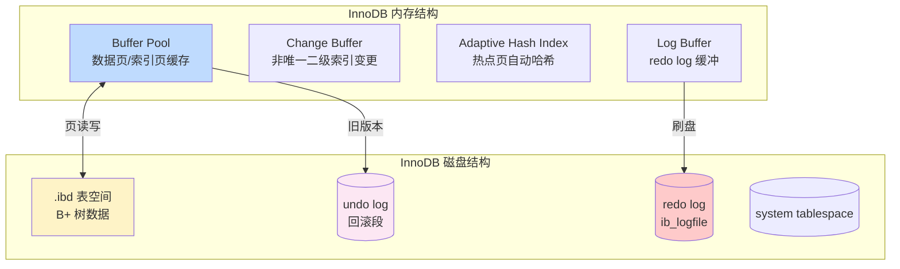
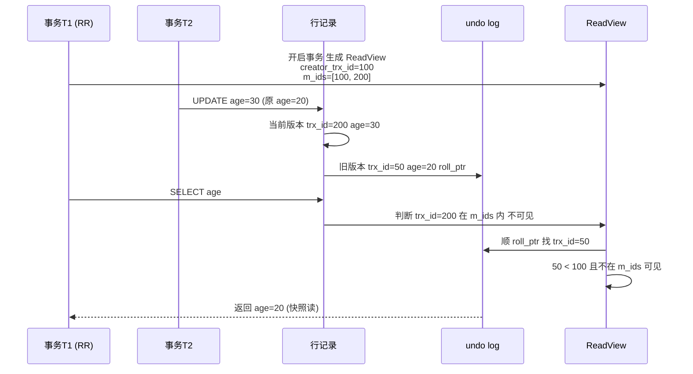
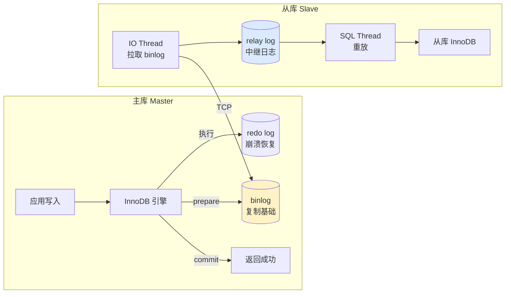

# 数据库 MySQL · 面经

## 核心问题
1. MySQL 的 InnoDB 存储引擎原理是什么？B+ 树索引为什么这样设计？
2. MySQL 的 MVCC 和锁机制怎么工作？RR 隔离级别如何避免幻读？
3. MySQL 主从复制原理是什么？主从延迟怎么优化？

## 答题要点

### InnoDB 存储引擎与 B+ 树

InnoDB 是 MySQL 5.5 起的默认存储引擎，支持 ACID 事务、行锁、MVCC、外键。核心由 B+ 树索引、Buffer Pool、undo log、redo log、binlog 组成。

**B+ 树索引设计**：
- **聚簇索引（Clustered Index）**：按主键组织的 B+ 树，叶子节点存**完整行数据**。一张表只有一个聚簇索引（默认主键，无主键用唯一非空索引，再无则生成隐藏 ROW_ID）。
- **二级索引（Secondary Index）**：叶子节点存**索引列值 + 主键值**，查询非索引列需"回表"（用主键查聚簇索引）。
- **覆盖索引**：查询列都在二级索引里，无需回表，`EXPLAIN` 显示 `Using index`。

**为什么 B+ 树（而非 B 树/Hash/红黑树）**：
| 数据结构 | 磁盘 IO | 范围查询 | 适合磁盘 |
|---------|---------|---------|---------|
| Hash | O(1) 等值快 | 不支持 | 内存场景 |
| 红黑树 | 树高 logN，N 大时高 | 中序遍历 | 内存场景 |
| B 树 | 非叶存数据，树高较高 | 需中序遍历 | 一般 |
| **B+ 树** | 非叶只存索引，树矮（3-4 层支撑千万级） | 叶子链表范围扫 | **最佳** |

B+ 树非叶节点不存数据，单页能放更多索引键，树更矮。InnoDB 默认页 16KB，非叶节点可放约 1170 个键（假设键+指针 14 字节），3 层 B+ 树可支撑 `1170 × 1170 × 16 ≈ 2000 万`行。范围查询靠叶子节点的双向链表，顺序扫描高效。

### MVCC 与锁机制

**MVCC 三要素**：
- **隐藏列**：每行有 `trx_id`（最后修改事务 ID）、`roll_ptr`（指向 undo log 旧版本）。
- **undo log 版本链**：每次 UPDATE 产生旧版本，通过 `roll_ptr` 串成链。
- **ReadView**：事务开启时生成的快照，包含 `creator_trx_id`（当前事务 ID）、`m_ids`（活跃事务 ID 列表）、`min_trx_id`、`max_trx_id`。

**可见性判断规则**（核心）：
1. `trx_id < min_trx_id`：事务已提交，可见。
2. `trx_id >= max_trx_id`：事务在 ReadView 生成后才开启，不可见。
3. `min_trx_id <= trx_id < max_trx_id`：看是否在 `m_ids` 中，在则活跃不可见，不在则已提交可见。
4. 不可见则顺 `roll_ptr` 找旧版本，重复判断。

**RC vs RR 的差异**：
- **RC（读已提交）**：每次 SELECT 都生成新 ReadView，能看到最新已提交数据。
- **RR（可重复读）**：事务第一次 SELECT 生成 ReadView，整个事务复用，保证可重复读。

**RR 如何避免幻读**：
- **快照读**（普通 SELECT）：靠 MVCC，读 ReadView 快照，不会看到新插入的行，无幻读。
- **当前读**（`SELECT ... FOR UPDATE` / `UPDATE` / `DELETE`）：靠 **Next-Key Lock**（行锁 + 间隙锁）锁定范围，阻止其他事务在范围内插入。

**锁层级**：
| 锁类型 | 范围 | 作用 |
|--------|------|------|
| Record Lock | 单行 | 锁索引记录 |
| Gap Lock | 间隙 | 锁索引间隙，阻止插入 |
| Next-Key Lock | 行 + 前间隙 | RR 默认，防幻读 |
| Insert Intention Lock | 插入意向 | 插入前申请，与 Gap Lock 冲突 |

**死锁排查**：`SHOW ENGINE INNODB STATUS` 看 `LATEST DETECTED DEADLOCK`，配合 `information_schema.innodb_trx` 查事务。死锁会被 InnoDB 自动检测回滚代价小的事务。

### 主从复制

**复制三步骤**：
1. Master 写 binlog（二进制日志，STATEMENT/ROW/MIXED 三种格式，推荐 ROW）。
2. Slave IO Thread 连接 Master，拉取 binlog 写入本地 relay log。
3. Slave SQL Thread 读 relay log，重放 SQL 到从库。

**复制演进**：
- **异步复制**：默认，Master 不等 Slave 确认，性能高但可能丢数据。
- **半同步复制**：Master 至少等一个 Slave ACK 才返回客户端，`rpl_semi_sync_master_wait_for_slave_count` 控制确认数。
- **MGR（Group Replication）**：基于 Paxos 变体，多主一致，但运维复杂。
- **并行复制**：5.7 引入基于组提交的并行（`slave_parallel_type=LOGICAL_CLOCK`），5.6 是基于库的并行。

**主从延迟根因与优化**：
| 根因 | 现象 | 优化 |
|------|------|------|
| 单线程重放（5.6 前） | 大事务卡死 | 升级 5.7+，开并行复制 |
| 大事务 | 延迟突增 | 拆小事务，避免 `DELETE 10万行` |
| 从库硬件差 | 持续延迟 | 从库配置 ≥ 主库 |
| 从库承担读流量 | 高峰延迟 | 读写分离读流量控制，核心读走主库 |
| DDL | 全表锁延迟 | 低峰执行，pt-online-schema-change |
| 网络抖动 | IO Thread 断连 | 优化网络，`slave_net_timeout` 调小 |

**监控延迟**：`SHOW SLAVE STATUS` 的 `Seconds_Behind_Master`（不准确，只反映 binlog 重放延迟，不含 IO 拉取延迟），更准确用 pt-heartbeat（心跳表实测）。

**读写分离方案**：
- 应用层：ShardingSphere、MyCat 中间件路由。
- Proxy 层：ProxySQL、MaxScale、MySQL Router。
- 驱动层：MySQL Connector/J 的 ReplicationDriver。

## 加分回答

InnoDB 的 B+ 树设计是磁盘存储的工程艺术。为什么非叶节点不存数据？因为磁盘 IO 是按页（16KB）读的，非叶节点不存数据意味着单页能放更多索引键，树更矮。3 层 B+ 树支撑 2000 万行，意味着一次等值查询最多 3 次磁盘 IO（实际 Buffer Pool 命中热数据后多为内存访问）。为什么叶子节点用双向链表？范围查询 `WHERE id BETWEEN 100 AND 200` 定位到 id=100 后顺链表扫描即可，无需回树。这两个设计让 B+ 树在磁盘场景"等值快、范围顺"。Hash 索引虽然等值 O(1) 但不支持范围，内存引擎 Memory 才用。所以 InnoDB 没有"Hash 索引类型"，但有"自适应哈希索引"（AHI）--InnoDB 监控热点查询，自动在内存里建哈希，等值查询直接命中，绕过 B+ 树遍历，这是"用空间换时间"的优化。

MVCC 的 ReadView 可见性判断是面试高频，但很多人只记规则不记原理。原理是"事务 ID 单调递增 + 活跃事务列表"，ReadView 生成时记录当前所有未提交事务 ID（m_ids），凡是 trx_id 落在 m_ids 内的事务都"不可见"（因为生成 ReadView 时它们还没提交）。RR 级别复用 ReadView 保证可重复读，RC 每次生成新 ReadView 能看到最新已提交。这个设计的精妙在于"无锁读"--读事务不需要加锁，只看版本链，写事务也不阻塞读事务。代价是 undo log 版本链可能很长（长事务 + 频繁更新），导致 undo 段膨胀，purge 线程清理慢。生产要监控 `information_schema.innodb_trx` 的长事务，超过 30 秒告警，避免"长事务拖垮 undo"。

主从延迟是 MySQL 运维的"老大难"，根因是"单线程重放"的历史包袱（5.7 前从库 SQL Thread 单线程）。5.7 的并行复制基于组提交（group commit），同一组内的事务可以并行重放，但要主库组提交粒度够才有效。生产优化三板斧：升 5.7+ 开 `slave_parallel_type=LOGICAL_CLOCK` + `slave_parallel_workers=16`；从库配置不低于主库尤其 IO；核心读不走从库（半同步 + 主读从写或直接主读）。大事务是延迟杀手，一条 `DELETE FROM t WHERE create_time < 'xxx'` 删百万行会让从库卡几分钟，必须拆成每次删 1000 行循环。pt-heartbeat 是监控延迟的黄金工具，原理是在主库写心跳表，从库读心跳表的时间差就是真实延迟，比 `Seconds_Behind_Master` 准确得多。

## 口播版短文案

InnoDB 用 B+ 树，聚簇索引按主键组织叶子存完整行数据，二级索引叶子存主键值要回表。为啥 B+ 树不是 B 树 Hash 红黑树？因为非叶节点不存数据单页放更多键树更矮，3 层撑 2000 万行，叶子双向链表范围扫描顺。MVCC 三要素：隐藏列 trx_id 加 roll_ptr、undo log 版本链、ReadView 快照。可见性判断：trx_id 小于 min 已提交可见，大于 max 是新事务不可见，在 m_ids 里是活跃不可见。RC 每次 SELECT 生成新 ReadView 看到 latest，RR 复用第一次的 ReadView 保证可重复读。RR 防幻读：快照读靠 MVCC，当前读靠 Next-Key Lock 行锁加间隙锁。主从复制三步：主库写 binlog，从库 IO Thread 拉到 relay log，SQL Thread 重放。延迟优化三板斧：升 5.7 开并行复制、从库配置不低于主库、核心读不走从库。监控延迟别用 Seconds_Behind_Master，用 pt-heartbeat 心跳表实测最准。

## 标签
MySQL, InnoDB, B+树, MVCC, Next-Key Lock, 主从复制, 半同步, 运维面试
