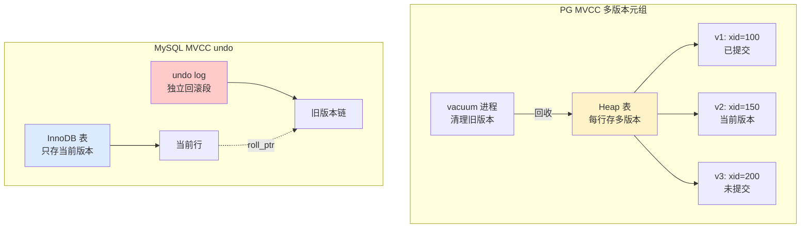
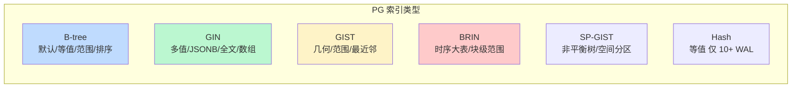
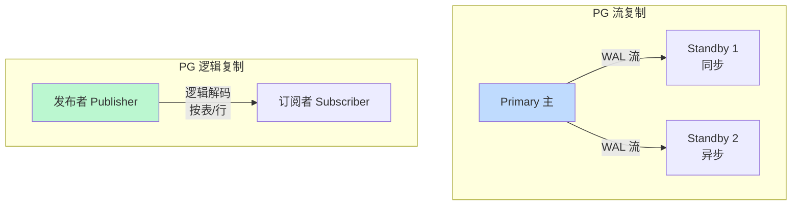

# 数据库 PostgreSQL · 面经

## 核心问题
1. PostgreSQL 和 MySQL 的核心区别是什么？什么场景该选 PG？
2. PG 的 MVCC 多版本并发控制怎么实现？和 MySQL InnoDB 的 MVCC 有何不同？
3. PG 的索引类型有哪些？B-tree / GIN / GIST / BRIN 各适用什么场景？

## 答题要点

### PG vs MySQL 核心区别

| 维度 | PostgreSQL | MySQL |
|------|-----------|-------|
| 设计哲学 | 学术严谨、SQL 标准忠实、功能丰富 | 简单实用、Web 场景优化、易上手 |
| 存储引擎 | 单一 Heap 表 + 多索引类型 | 多引擎可插拔（InnoDB/MyISAM） |
| MVCC 实现 | 基于多版本元组（旧版本留在表中） | 基于 undo log（旧版本在独立回滚段） |
| 事务隔离 | 默认 RC，支持 SERIALIZABLE（SSI） | 默认 RR，SERIALIZABLE 实现较弱 |
| 数据类型 | 极丰富（JSONB/数组/范围/几何/网络） | 基础类型 + JSON（无 JSONB） |
| 索引类型 | B-tree/Hash/GIN/GIST/BRIN/SP-GIST | B-tree/Hash（8.0 后基本只用 B-tree） |
| 复杂查询 | 优化器强（CTE/窗口函数/物化视图） | 较弱（8.0 才有窗口函数） |
| 复制 | 逻辑复制 + 流复制 | binlog 复制（异步/半同步/MGR） |
| 扩展性 | 扩展机制强（PostGIS/timescaledb/pgvector） | 插件机制弱 |
| 协议 | 单进程多线程（每连接一进程） | 多线程（线程池） |

**什么场景选 PG**：
1. **复杂分析查询**：窗口函数、CTE 递归、物化视图，PG 优化器更强。
2. **GIS 地理数据**：PostGIS 是事实标准，MySQL 空间索引弱。
3. **JSON 重度使用**：JSONB 二进制存储 + GIN 索引，可高效查询半结构化数据。
4. **时序数据**：TimescaleDB 扩展（基于 PG）。
5. **向量检索**：pgvector 扩展，AI/RAG 场景。
6. **强一致性 + 复杂事务**：SSI 可串行化隔离，金融场景。

**什么场景选 MySQL**：
1. **互联网 Web 应用**：生态成熟、运维简单、人才多。
2. **读写分离 + 主从**：MySQL 复制更成熟。
3. **团队熟悉度**：国内 MySQL 人才储备远超 PG。

### PG 的 MVCC 实现

PG 的 MVCC 与 MySQL InnoDB 的根本差异在于"旧版本存哪里"：PG 把旧版本直接留在主表（Heap）中，MySQL 把旧版本放在独立的 undo log。

**PG MVCC 工作机制**：
- 每个元组（tuple）带 `xmin`（创建事务 ID）和 `xmax`（删除事务 ID）。
- 读事务拿快照（`SnapshotData`），根据 `xmin/xmax` 与快照可见性判断，决定该版本是否可见。
- UPDATE = DELETE + INSERT（标记旧版本 xmax + 插入新版本），旧版本留在表中。
- 旧版本靠 **VACUUM** 进程清理（回收空间），不清理会导致表膨胀（bloat）。

**与 MySQL InnoDB MVCC 对比**：
| 维度 | PG | MySQL InnoDB |
|------|-----|-------------|
| 旧版本位置 | 主表 Heap | undo log |
| 回滚 | 旧版本已在表中，回滚标记 xmax | undo log 反向操作 |
| 空间清理 | VACUUM（需手动/autovacuum） | undo 自动清理（purge） |
| 表膨胀风险 | 高（VACUUM 不及时） | 低（undo 独立） |
| 读旧版本 | 直接读表（可能触发 IO） | 通过 undo 链构建 |
| 长事务影响 | 阻止 VACUUM 回收，表膨胀 | undo 段膨胀 |

**PG MVCC 的代价--表膨胀**：
- 频繁 UPDATE/DELETE 产生大量死元组（dead tuple），若 VACUUM 不及时，表物理文件持续增长，查询要扫描更多页面。
- `autovacuum` 默认开启，参数：`autovacuum_vacuum_threshold`（默认 50）、`autovacuum_vacuum_scale_factor`（默认 0.2，即 20% 变化触发）。
- 写密集场景需调小 scale_factor（如 0.05）更频繁 vacuum；超大表可配 `autovacuum_vacuum_insert_scale_factor` 单独控制 insert。
- 严重膨胀需 `VACUUM FULL`（锁表重建）或 `pg_repack`（在线重建），生产慎用 FULL。

### PG 索引类型

| 索引类型 | 适用场景 | 示例 | 特点 |
|---------|---------|------|------|
| **B-tree** | 默认，等值/范围/排序 | `WHERE id = 1`、`WHERE id > 10 ORDER BY id` | 最通用，支持 `=`/`<`/`>`/`BETWEEN`/`IN`/`IS NULL` |
| **GIN** | 多值字段、JSONB、全文、数组 | `WHERE tags @> ARRAY['a']`、`WHERE data @> '{"k":"v"}'` | 倒排索引，支持包含查询，更新慢 |
| **GIST** | 几何、范围、KNN 最近邻 | `WHERE location && box`、`ORDER BY loc <-> point LIMIT 10` | 支持空间操作符，PostGIS 基础 |
| **BRIN** | 时序大表、物理排序好的列 | 时间戳列上的范围查询 | 块级范围索引，极小，适合顺序数据 |
| **SP-GIST** | 非平衡树、空间分区 | IP 路由、电话区号 | 适合非平衡数据分布 |
| **Hash** | 等值查询 | `WHERE id = 1` | 10.0+ 支持 WAL 仿制崩溃安全，仅等值 |

**选型建议**：
- 默认 B-tree，覆盖 90% 场景。
- JSONB 字段查询用 GIN（`CREATE INDEX idx ON t USING gin(data jsonb_path_ops)`）。
- 全文搜索用 GIN + `tsvector`（`CREATE INDEX idx ON t USING gin(to_tsvector('english', body))`）。
- 数组包含查询用 GIN。
- 地理/几何数据用 GIST + PostGIS。
- 时序大表（按时间递增）的时间戳列用 BRIN，索引只有几 MB（B-tree 要 GB 级）。

**部分索引与表达式索引（PG 亮点）**：
- 部分索引：`CREATE INDEX idx ON t(status) WHERE status = 'active'`，只为活跃数据建索引，省空间。
- 表达式索引：`CREATE INDEX idx ON t(lower(email))`，对函数结果建索引，支持 `WHERE lower(email) = 'x'`。

### 复制与高可用

- **流复制（Streaming Replication）**：基于 WAL 字节流，物理复制，Standby 与 Primary 完全一致。同步模式（`synchronous_commit=on` + `synchronous_standby_names`）保证零数据丢失，但牺牲性能。
- **逻辑复制（Logical Replication）**：基于逻辑解码，按表/行订阅，可跨版本/跨平台/选择性复制。适合多活、ETL、版本升级。
- **高可用方案**：Patroni + etcd/Consul 是主流，自动故障转移；repmgr 较轻；Stolon 较新。

## 加分回答

PG 的 MVCC 设计是"用空间换一致性"的极致--旧版本留在主表，读事务永远不阻塞写事务，写事务也几乎不阻塞读事务（除了显式锁）。代价是表膨胀和 VACUUM 开销。很多团队从 MySQL 迁到 PG 后被"表莫名其妙变大"吓到，根因就是没调 autovacuum 参数。生产经验：写密集表把 `autovacuum_vacuum_scale_factor` 从默认 0.2 调到 0.05-0.1，`autovacuum_analyze_scale_factor` 同步调小，让 vacuum 更积极；超大表分区（pg_partman）后按分区 vacuum，避免单表 vacuum 扫描太久；监控 `pg_stat_user_tables` 的 `n_dead_tup`，死元组超过 10 万就该 vacuum 了。严重膨胀用 `pg_repack`（基于触发器在线重建），别用 `VACUUM FULL`（锁表）。

PG 的 JSONB 是被低估的能力，很多团队用 MongoDB 处理半结构化数据，其实 PG JSONB + GIN 索引能覆盖大部分场景，还能享受 ACID 事务和丰富查询能力。JSONB 是二进制存储（不像 JSON 文本存储），支持 `@>`（包含）、`?`（键存在）、`->>`（取值）等操作符，配合 GIN 索引能高效查询。典型用法：`CREATE INDEX idx ON t USING gin(data jsonb_path_ops)`，查询 `WHERE data @> '{"category":"book","price":{"$gt":100}}'`。jsonb_path_ops 索引比默认 jsonb 索引小且快，但只支持 `@>` 操作符。选择标准：如果半结构化数据是主要存储模式且需要灵活 schema，MongoDB 仍更优；如果结构化数据为主、JSON 是辅助字段，PG JSONB 完全够用且更简单（一套数据库一套运维）。

## 口播版短文案

PG 和 MySQL 最大区别在 MVCC：PG 把旧版本留在主表里，MySQL 放 undo log。所以 PG 读不阻塞写写不阻塞读，但代价是表膨胀，要靠 VACUUM 清理旧版本，写密集场景要调小 autovacuum 的 scale_factor 到 0.05，否则表越来越大查询越来越慢。MySQL 的 undo 自动清理没这毛病。选 PG 的场景：复杂分析查询、GIS 地理用 PostGIS、JSONB 半结构化数据加 GIN 索引、时序用 TimescaleDB、向量检索用 pgvector、强事务一致性。选 MySQL 的场景：Web 应用、团队熟悉、读写分离。PG 索引五大金刚：B-tree 默认覆盖 90%，GIN 用于 JSONB 数组全文，GIST 用于几何空间，BRIN 用于时序大表索引极小，SP-GIST 用于非平衡数据。PG 两个亮点：部分索引只为活跃数据建省空间，表达式索引对函数结果建索引。复制分流复制物理同步和逻辑复制按表订阅，高可用用 Patroni 加 etcd 自动故障转移。

## 标签
PostgreSQL, MVCC, VACUUM, GIN索引, JSONB, PostGIS, 流复制, 运维面试
