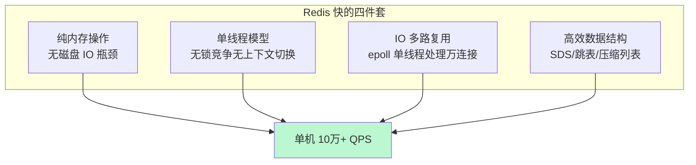
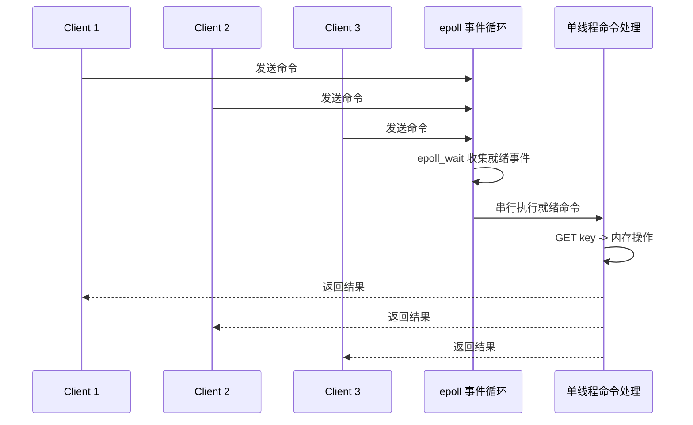
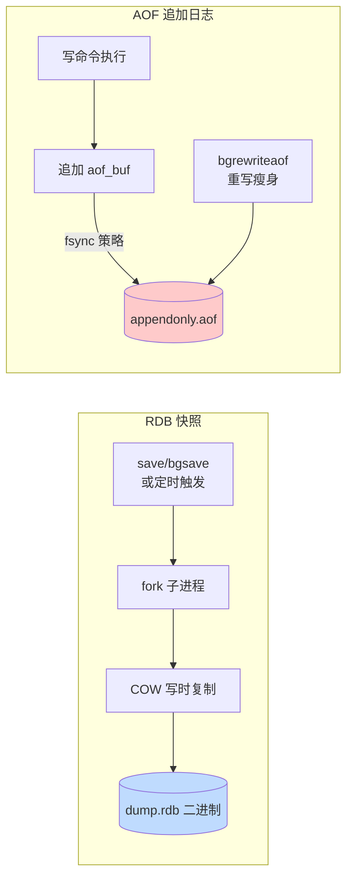
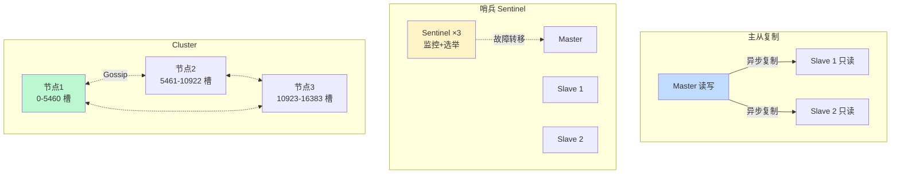

# 数据库 Redis · 面经

## 核心问题
1. Redis 为什么这么快？单线程模型怎么做到高并发？
2. Redis 的数据结构和持久化机制是什么？RDB 和 AOF 怎么选？
3. Redis 集群方案对比？主从、哨兵、Cluster 怎么选？

## 答题要点

### Redis 为何快 + 单线程模型

Redis 单机可达 10 万+ QPS，快的原因是"四件套 + 单线程模型"。

**单线程为何快**：
- **无锁竞争**：所有命令串行执行，无需加锁/解锁、无死锁。
- **无上下文切换**：多线程在 CPU 间切换有开销（寄存器、缓存失效），单线程无此开销。
- **无竞态条件**：复杂命令（如 LPUSH + INCR）天然原子，无需事务保证。
- **瓶颈不在 CPU**：Redis 操作是内存级，瓶颈在网络 IO 和内存带宽，多线程对 CPU 密集无优势。

**IO 多路复用模型**：

- Redis 6.0 前：单线程处理所有客户端连接的读写 + 命令执行。
- Redis 6.0+：引入多线程处理网络 IO（读写 socket），但**命令执行仍单线程**。因为命令执行是内存操作极快，瓶颈在网络 IO，多线程处理 IO + 单线程执行命令是最佳平衡。
- 注意：单线程不意味着只有一个线程，Redis 有后台线程做异步任务（aof 重写、关闭文件、惰性删除大 key）。

### 数据结构

Redis 对外暴露 5 大基础类型 + 5 个扩展类型，底层有多种实现，根据数据规模自动切换编码以省内存。

| 对外类型 | 底层编码（按规模升级） | 典型场景 |
|---------|---------------------|---------|
| String | int / embstr / raw（SDS） | 计数器、缓存对象、分布式锁 |
| List | quicklist（双向链表+ziplist 节点） | 消息队列、最新 N 条 |
| Hash | ziplist（小） / hashtable（大） | 对象存储（比 String 存 JSON 省） |
| Set | intset（纯整数） / hashtable | 去重、标签、共同好友 |
| ZSet | ziplist（小） / skiplist+hashtable（大） | 排行榜、延迟队列 |
| Stream | radix tree + listpack | 消息流（带消费者组） |
| Bitmap | String 位操作 | 布隆过滤器、签到统计 |
| HyperLogLog | 稀疏/密集表示 | 基数统计（UV）误差 0.81% |
| Geo | ZSet 存 Geohash | 附近的人 |
| Stream | radix tree | 持久化消息队列 |

**关键数据结构原理**：
- **SDS（Simple Dynamic String）**：带长度的字符串，O(1) 获取长度，二进制安全，空间预分配+惰性释放减少内存重分配。
- **跳表（SkipList）**：ZSet 的核心，多层索引链表，查询 O(logN)，比红黑树实现简单且范围查询高效（排行榜的核心）。
- **压缩列表（ziplist）**：连续内存存储的小数据结构，省指针开销，元素少时用。7.0 引入 listpack 替代。

### 持久化机制

**RDB（快照）**：
- 触发：`save`（阻塞主线程，生产禁用）/ `bgsave`（fork 子进程）/ 定时规则 `save 900 1`。
- 原理：fork 子进程利用 COW（Copy-On-Write）写时复制，子进程遍历内存写 RDB 文件，主进程继续服务。写期间主进程修改的数据，OS 会复制页给子进程保证一致性。
- 优点：文件小、恢复快、适合备份。
- 缺点：两次快照间的数据会丢，fork 大内存实例耗时（1G 内存 fork 约 20ms）。

**AOF（追加日志）**：
- 原理：记录每条写命令到 AOF 文件，恢复时重放。
- fsync 策略（`appendfsync`）：
  - `always`：每条命令 fsync，最安全但性能差（不推荐）。
  - `everysec`（默认）：每秒 fsync 一次，崩溃最多丢 1 秒，性能与安全平衡，**生产推荐**。
  - `no`：由 OS 决定 fsync，性能好但数据安全无保障。
- **重写（Rewrite）**：AOF 文件越来越大，定期 bgrewriteaof 把多条命令合并为等价的最小命令集（如 100 次 INCR 合并为 1 次 SET）。触发：`auto-aof-rewrite-percentage 100`（文件翻倍）+ `auto-aof-rewrite-min-size 64mb`。

**RDB vs AOF 选型**：
| 维度 | RDB | AOF |
|------|-----|-----|
| 数据安全 | 丢两次快照间数据 | everysec 最多丢 1 秒 |
| 文件大小 | 小（二进制压缩） | 大（文本命令） |
| 恢复速度 | 快 | 慢（重放命令） |
| 性能影响 | fork 时短暂卡顿 | 每次写追加，持续开销 |
| 可读性 | 不可读 | 文本可读可编辑 |

**生产推荐**：
- 只做缓存（丢了能从 DB 重建）：RDB 足矣，简单轻量。
- 做持久化存储（如分布式锁、计数器）：RDB + AOF 混用（4.0+），AOF 保障安全，RDB 加速恢复与冷备。
- 极致安全：AOF `appendfsync always`（性能损失大，慎用）。

### 集群方案对比

| 方案 | 数据分片 | 高可用 | 容量上限 | 复杂度 | 适用场景 |
|------|---------|--------|---------|--------|---------|
| 主从 | 不分片 | 手动切换 | 单机内存 | 低 | 读多写少 + 手动运维 |
| 哨兵 | 不分片 | 自动故障转移 | 单机内存 | 中 | 中小规模 + 自动 HA |
| Cluster | 16384 槽分片 | 节点级 HA | 水平扩展 | 高 | 大数据量 + 高吞吐 |

**主从复制**：全量同步（PSYNC）+ 增量同步（repl_backlog）。Master 写命令传播到 Slave，异步复制有延迟。

**哨兵（Sentinel）**：
- 至少 3 个 Sentinel 节点（奇数，避免脑裂）。
- 监控 Master/Slave 健康，Master 客观下线（quorum 个 Sentinel 同意）后选举 leader 执行故障转移。
- 选新 Master 规则：优先级 `slave-priority` > 复制偏移量大 > runid 小。
- 客户端连 Sentinel 获取 Master 地址，故障转移后自动切换。

**Cluster**：
- 16384 个槽（slot）分布在所有主节点，key 经 CRC16 取模定位槽，`slot = CRC16(key) % 16384`。
- 每个主节点配一个从节点（可多个），主挂从提升。
- Gossip 协议节点间通信，自动故障检测与转移。
- **限制**：跨槽操作受限，`mset`/`事务`/`Lua` 跨槽报错，需用 hash tag `{tag}` 让相关 key 落同槽。
- 扩容需迁移槽（redis-cli reshard），数据量大时迁移耗时。

**选型决策**：
- 数据量小（< 32GB）+ 需 HA：哨兵，简单可靠。
- 数据量大或预期增长快：Cluster 提前分片。
- 仅读扩展：主从 + 读写分离。
- 极致简单：单实例（仅缓存场景）。

## 加分回答

Redis 单线程模型是它"快"的核心，但也是它"慢"的根源。单线程意味着一个慢命令会阻塞所有客户端，这是 Redis 最大的风险。生产三大慢命令杀手：`KEYS *`（遍历所有 key，O(N)，几百万 key 能卡几秒，绝对禁用，用 `SCAN` 替代）；`SORT` 大集合排序（O(NlogN)）；`HGETALL`/`SMEMBERS`/`LRANGE 0 -1` 大 key 全量返回。生产要建立"慢命令"防线：开启 `slowlog-get` 监控慢命令（默认 >10ms 记录）；用 `SCAN` 替代 `KEYS`，`HSCAN`/`SSCAN`/`ZSCAN` 替代全量返回；大 key 拆分（如把 10 万元素的 Hash 拆成多个小 Hash）。Redis 4.0+ 的 `lazyfree` 机制能把删除大 key 放后台线程异步执行，避免 `DEL` 大 key 阻塞主线程。一个真实教训：某团队在 Redis 里存了一个 50MB 的 Hash，每次 `HGETALL` 要 200ms，期间整个 Redis 卡住，所有业务超时，最后只能深夜紧急拆 key。

Redis 的内存管理是运维的另一个暗坑。Redis 所有数据在内存，没有自动淘汰机制（除非配了 maxmemory + 淘汰策略），写满会 OOM 拒绝写入甚至崩溃。生产必配 `maxmemory`（建议物理内存的 60-70%，留余量给系统和 fork）+ 淘汰策略：`allkeys-lru`（缓存场景推荐，淘汰最久未使用）/ `volatile-lru`（只淘汰带 TTL 的，适合混合场景）/ `noeviction`（不淘汰，写满拒绝写入，适合持久化存储）。监控 `used_memory_rss`（实际物理内存）和 `used_memory`（逻辑内存），RSS 远大于 used 说明内存碎片严重（fragmentation ratio > 1.5），用 `MEMORY PURGE` 或重启清理。fork 是内存翻倍的隐患：fork 子进程做 RDB/AOF 重写时，COW 机制下若写量大，OS 要复制页，内存可能翻倍，所以 maxmemory 不能设太满。

## 口播版短文案

Redis 快四件套：纯内存无磁盘 IO、单线程无锁无切换、epoll IO 多路复用单线程处理万连接、高效数据结构 SDS 跳表压缩列表。单线程为啥快？因为瓶颈不在 CPU 在网络 IO，6.0 后多线程处理网络 IO 但命令执行仍单线程保持原子。持久化 RDB 加 AOF：RDB 是 fork 子进程 COW 写快照恢复快但丢两次快照间数据，AOF 追加写命令 everysec 每秒 fsync 最多丢 1 秒，重写瘦身。生产做缓存用 RDB 够，做持久化用 RDB 加 AOF 混用。集群三方案：主从不分片读写分离适合读扩展，哨兵 3 节点监控自动故障转移适合 32G 内中小规模，Cluster 16384 槽分片水平扩展适合大数据量高吞吐。选型：数据量小用哨兵简单可靠，数据量大用 Cluster 提前分片。三大坑：KEYS 星号禁用用 SCAN，大 key 拆分，maxmemory 设物理内存 60% 配 allkeys-lru 淘汰。慢命令是单线程最大风险，slowlog 监控必开。

## 标签
Redis, 单线程模型, IO多路复用, RDB, AOF, 哨兵, Redis Cluster, 运维面试
