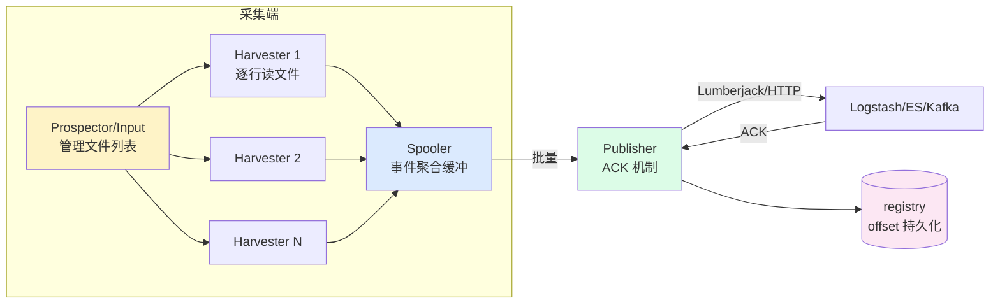
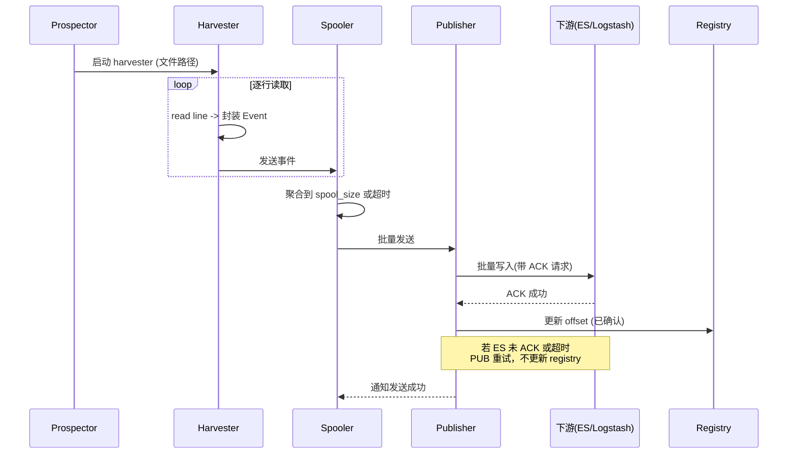
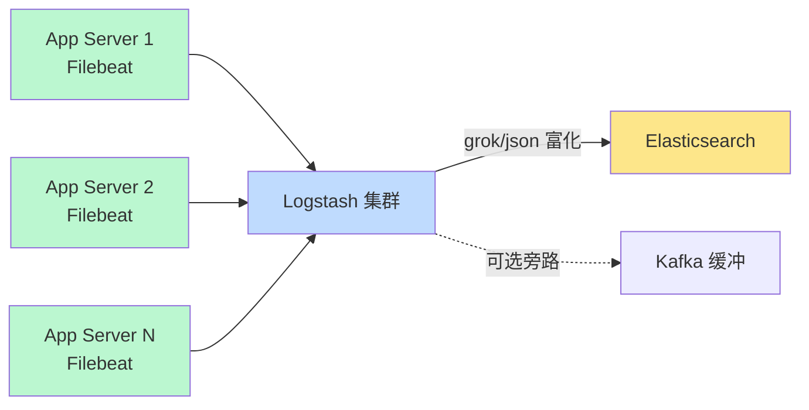

# 中间件 Filebeat · 面经

## 核心问题
1. Filebeat 的工作原理是什么？harvester 和 spooler 怎么协作保证日志不丢？
2. Filebeat 如何实现 at-least-once 语义？registry 文件起什么作用？
3. Filebeat 与 Logstash 都能采集日志，生产中如何选型与组合？

## 答题要点

### Filebeat 整体架构

Filebeat 是 Elastic 官方的轻量级日志采集器，Go 编写，单二进制部署，核心由 prospector（input）、harvester、spooler、publisher 组成。



- **Prospector/Input**：负责管理采集目标（文件路径、容器 stdout、Kafka 等），定期扫描文件变更，为每个文件启动一个 harvester。
- **Harvester**：每个文件一个 harvester goroutine，逐行读取文件内容封装为事件，是 Filebeat 的"采集单元"。
- **Spooler**：聚合 harvester 产出的事件，达到 `spool_size`（默认 2048）或 `idle_timeout`（默认 5s）后批量发给 publisher。
- **Publisher**：负责将事件批量发送到下游（Logstash/ES/Kafka），并等待下游 ACK；未 ACK 的事件会重试。
- **Registry**：本地磁盘文件（`data/registry`），记录每个源（文件路径+inode）的已确认 offset，是 at-least-once 的基石。

### Harvester 与 Spooler 协作时序



- offset 只有在下游 ACK 后才写入 registry，保证"已确认的数据不会重复采集"。
- 若 Filebeat 崩溃：重启后读 registry，从最后确认的 offset 继续读，未 ACK 的数据重发（at-least-once）。
- 若文件被截断/轮转：harvester 靠 inode 跟踪，文件 rename 不影响读取；`close_inactive`（默认 5 分钟）无新数据则关闭 harvester 释放资源。

### At-Least-Once 语义实现

| 环节 | 机制 | 说明 |
|------|------|------|
| 采集 | harvester 逐行读 | 行级粒度，断点续读 |
| 缓冲 | spooler 内存批量 | 不落盘，靠下游 ACK 驱动 |
| 传输 | publisher 批量 + ACK | 下游确认后才推进 offset |
| 持久化 | registry 文件 | 记录每个源的已确认 offset |
| 重启恢复 | 读 registry 定位 | 从上次 ACK 的位置继续 |

**可能重复的场景**：
1. Filebeat 发送成功但 ACK 丢失（网络抖动）：重发，下游需幂等（ES 用 `_id` 去重）。
2. registry 写入失败但下游已写入：重启后重发，同上需幂等。
3. 文件轮转时旧文件未读完被删：配 `clean_inactive` + `ignore_older` 平衡。

**不会丢数据的场景**（前提是下游持久化）：
- Filebeat 进程崩溃：registry 记录已确认 offset，未确认的下次重发。
- 下游短暂不可用：publisher 重试 + 内存队列缓冲，超过内存上限会反压 harvester 暂停读取。

### 关键配置调优

```yaml
filebeat.inputs:
  - type: log
    paths: [/var/log/app/*.log]
    harvester_buffer_size: 16384      # 单 harvester 读取缓冲，默认 16384
    max_bytes: 10485760               # 单行最大 10MB，防超长行撑爆内存
    close_inactive: 5m                # 无新数据 5 分钟关闭 harvester
    close_renamed: true               # 文件 rename 时关闭，避免句柄泄漏
    clean_inactive: 2h                # 2 小时无新数据清理 registry 条目
    ignore_older: 1h                  # 不采集 1 小时前的旧文件

queue.mem:
  events: 4096                        # 内存队列容量，默认 4096
  flush.min_events: 2048              # 触发刷新的最小事件数
  flush.timeout: 1s                   # 刷新超时

output.elasticsearch:
  hosts: ["es:9200"]
  bulk_max_size: 2048                 # 单次 bulk 请求最大文档数
  worker: 4                           # 输出并发数
  compression_level: 3                # gzip 压缩级别
```

- `harvester_buffer_size`：读缓冲，大行日志需调大。
- `queue.mem.events`：内存队列，下游慢时缓冲，过小易反压，过大 OOM。
- `bulk_max_size` + `worker`：输出并发，ES 端要配合调 `thread_pool.index.queue_size`。
- `compression_level`：网络带宽紧张时调到 3-5，CPU 换带宽。

### Filebeat vs Logstash 选型

| 维度 | Filebeat | Logstash |
|------|---------|---------|
| 语言/资源 | Go，10-30MB 常驻 | JRuby/JVM，500MB+ 堆 |
| 部署形态 | 每台业务机 DaemonSet/Agent | 中心集群 |
| 核心能力 | 采集 + 转发（轻解析） | 采集 + 重解析 + 富化 |
| 解析能力 | 基础（json/dropper/multiline） | 强（grok/ruby/mutate） |
| 可靠性 | ACK + registry，at-least-once | PQ + DLQ |
| 适合位置 | 边缘采集层 | 中心处理层 |

**生产组合范式**：


- 高峰期加 Kafka 做缓冲：Filebeat → Kafka → Logstash → ES，削峰填谷。
- 简单场景直连：Filebeat → ES（用 Filebeat 自带 processor 做轻解析），省去 Logstash。
- 多行日志（Java 异常栈）：Filebeat `multiline.pattern: '^\s'` 合并行，避免栈被拆成多条。

## 加分回答

Filebeat 的 registry 是它"不丢数据"的核心，但也是运维的暗坑。registry 默认存在 `data/registry/filebeat/log.json`，记录每个 `path + inode` 的 offset。坑一：容器场景下 Pod 重建 inode 复用，Filebeat 可能误判"已读过"导致丢数据，解法是用 `container.id` 作为唯一键而非 inode。坑二：registry 文件无限增长，旧文件条目不清除，解法是配 `clean_inactive`（如 2 小时）和 `clean_removed`（文件删除即清理 registry）。坑三：registry 写入是同步 fsync，高吞吐下成为瓶颈，7.x 后可调 `registry.flush: 1s` 改为定时刷新，代价是崩溃时多丢 1 秒数据。生产要把 registry 放到独立磁盘，避免和日志采集抢 IO。

Filebeat 的 processors 是被低估的能力。很多人以为 Filebeat 只能采不能处理，其实它内置了 json、drop_fields、add_fields、dissect、script（JS）等 processor，能完成 80% 的轻解析需求，不必每条都过 Logstash。典型用法：JSON 日志用 `decode_json_fields` 直接解析，再用 `drop_fields` 去掉原始 `message` 字段省存储；多租户场景用 `add_fields` 打 `tenant_id` 标签便于下游路由。这种"边缘轻解析 + 中心重富化"的分工，能让 Logstash 集群规模减半。判断标准很简单：如果解析逻辑只需要字段操作，用 Filebeat processor；如果需要正则、多源 join、复杂条件分支，才上 Logstash。

## 口播版短文案

Filebeat 原理一句话：prospector 管文件，harvester 逐行读，spooler 聚合批量，publisher 发下游等 ACK。不丢数据的命门是 registry 文件，记录每个文件已确认的 offset，只有下游 ACK 了才推进。进程崩了重启，从 registry 上次位置继续读，没 ACK 的重发，这就是 at-least-once。容器场景有个坑，Pod 重建 inode 复用会误判已读，要用 container.id 当唯一键。调优三件套：内存队列 events 调到 4096 防反压，bulk_max_size 配 worker 调输出并发，压缩级别 3 省 bandwidth。生产标配 Filebeat 加 Logstash：Filebeat 轻量采集 30 兆常驻，Logstash 中心重解析，各司其职。简单场景 Filebeat 直连 ES，用 processor 做轻解析，能省掉 Logstash 集群。

## 标签
Filebeat, 日志采集, harvester, registry, at-least-once, ELK, 运维面试, 轻量agent
