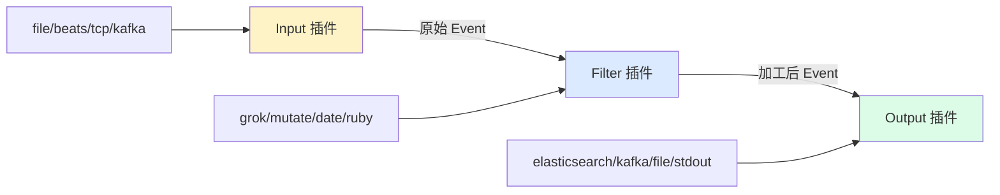
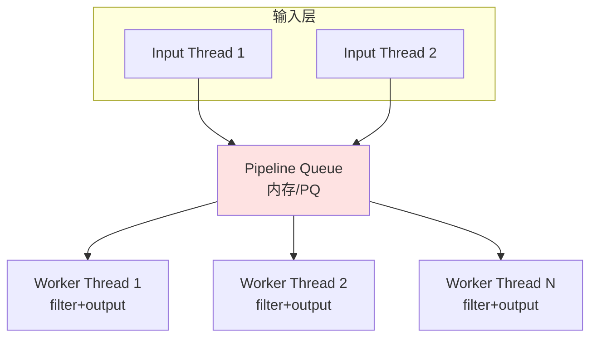
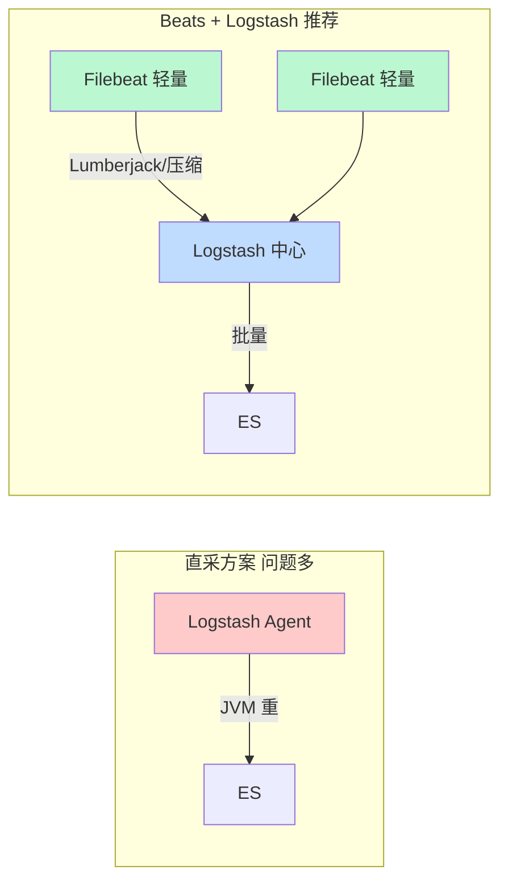

# 中间件 Logstash · 面经

## 核心问题
1. Logstash 的工作原理是什么？input-filter-output 三阶段流水线如何运转？
2. Logstash 性能瓶颈怎么定位？为什么生产环境几乎都用 Filebeat + Logstash 架构而不是 Logstash 直连采集？
3. Grok 解析失败如何兜底？Logstash 与 Fluentd/Fluent Bit 怎么选型？

## 答题要点

### Logstash 三阶段流水线

Logstash 是一个基于 JVM 的数据处理管道，核心模型是 `input | filter | output` 事件流水线，每条日志被封装为一个 `LogStash::Event` 对象在管道中流转。

- **Input**：负责数据采集，每个 input 启动一个独立线程从数据源拉取，写入一个有界队列。
- **Filter**：负责数据加工，grok 正则解析、mutate 字段增删改、date 时间戳标准化、ruby 自定义逻辑。filter 是可选的，也是性能消耗大头。
- **Output**：负责数据分发，常见的 elasticsearch、kafka、file。多个 output 并行写。
- **内部队列**：早期是内存队列（有界，默认 1000 事件），溢出会阻塞 input；7.x 引入持久化队列（PQ），基于磁盘，重启不丢数据，但吞吐下降约 30%。

### 工作线程模型

- 每个 pipeline 由一组 input 线程 + N 个 worker 线程组成，worker 同时执行 filter 和 output。
- worker 数由 `-w` / `pipeline.workers` 控制，默认等于 CPU 核数。
- batch 模式：worker 一次从队列拉 `pipeline.batch.size`（默认 125）条事件批量处理，提升 filter 与 output 的吞吐。

### 性能瓶颈定位与优化

| 瓶颈现象 | 定位手段 | 优化方向 |
|---------|---------|---------|
| CPU 打满 | `top -H` 看 worker 线程，jstack 看栈 | 多为 grok 正则回溯爆炸，预编译正则、用 `break_on_match` 提前退出 |
| 堆内存飙高/OOM | jstat 看 GC，jmap dump 堆 | 调大 `-Xmx`，减少 ruby filter 里的对象创建，缩小 batch.size |
| 输出端背压 | 看 Logstash 日志的 "backpressure" / ES 拒绝日志 | 扩 ES 写入能力、调大 `flush_size`、增加 output 超时 |
| 队列堆积 | `GET _node/stats/pipelines` 看 queue 事件数 | 增加 worker、拆分 pipeline、启用 PQ 防丢但需评估吞吐 |
| 网络瓶颈 | `nethogs` / `iftop` | output 启用压缩，减少跨可用区传输 |

**关键参数速查**：
- `pipeline.workers`：worker 数，建议 = CPU 核数，CPU 密集型 filter 可适当减少。
- `pipeline.batch.size`：批大小，CPU 密集建议 125，IO 密集（纯 output 到 ES）可调到 500-1000。
- `pipeline.batch.delay`：批等待时长（毫秒），默认 50，吞吐优先可调小。
- `queue.type`：`persisted` 启用持久化队列，`path.queue` 指定磁盘路径。
- `dead_letter_queue.enabled`：开启 DLQ，output 失败的事件进 DLQ 不阻塞管道。

### 为什么生产用 Filebeat + Logstash 而非 Logstash 直采

- **资源占用**：Logstash 基于 JVM，单实例常驻 500MB+ 堆，装到每台业务机不可接受；Filebeat 是 Go 写的单二进制，常驻 10-30MB。
- **侵入性**：Logstash 直采要在每台机器部署 JVM agent，运维成本高、升级风险大；Filebeat 一条命令分发。
- **职责分离**：Filebeat 专注"采+转发"（轻量、可靠），Logstash 专注"解析+富化"（重计算），各司其职。
- **容错**：Filebeat 自带 spooler + ACK 机制，Logstash 端挂了本地缓存不丢；Logstash 自身崩了只影响解析层，采集层不受影响。
- **弹性**：Logstash 可独立扩缩容，多实例消费 Filebeat 的 Lumberjack 输出，应对流量洪峰。

### Grok 解析失败兜底

Grok 是 Logstash 最常用也最易出问题的 filter，基于正则的预定义模式库（`%{COMBINEDAPACHELOG}` 等），失败时会打 `_grokparsefailure` 标签。

**兜底四件套**：
1. `break_on_match => true`：命中第一个 pattern 就退出，避免后续正则白白消耗 CPU。
2. 多 pattern 容错：`match => { "message" => ["pattern1", "pattern2", "fallback"] }`，最后一个用 `(?<message>.*)` 兜底全量捕获。
3. `tag_on_failure => ["_grok_fail"]`：失败打标签，后续用 `if "_grok_fail" in [tags]` 走旁路输出到单独 ES 索引，便于人工排查。
4. `timeout_millis => 1000`：防止正则回溯爆炸卡死 worker，超时自动放弃该事件并打标签。

### 与 Fluentd/Fluent Bit 选型

| 维度 | Logstash | Fluentd | Fluent Bit |
|------|---------|---------|-----------|
| 语言 | JRuby/JVM | Ruby/C | C |
| 内存 | 500MB+ | 40-100MB | 1-10MB |
| 插件生态 | 最丰富（200+） | 丰富（800+） | 较少但够用 |
| Kubernetes 集成 | 一般 | 好（CNCF 毕业） | 极好（轻量 DaemonSet） |
| 复杂解析能力 | 强（grok） | 中 | 中 |
| 适用场景 | 重解析层/中心节点 | 通用采集+路由 | 边缘轻量采集 |

**选型建议**：纯 ELK 栈用 Filebeat + Logstash；云原生 K8s 场景 Fluent Bit（DaemonSet 采集）+ Fluentd/Logstash（中心解析）更轻；极致轻量边缘（IoT/边缘节点）只用 Fluent Bit 直送 ES/Kafka。

## 加分回答

Logstash 的设计哲学是"管道即配置"--用声明式 DSL 描述数据流，不写代码就能完成采集-解析-分发。这降低了使用门槛，但也埋了坑：grok 正则是性能黑洞，一条复杂的正则回溯能把单核打满，表现为 worker CPU 100% 但吞吐上不去。生产排查要看 `GET _node/stats/pipelines` 的 `filter.in` 与 `filter.out` 差值，差值持续扩大说明 filter 卡住。治本之道是"能预解析的别用 grok"：JSON 日志用 `json` filter 直接解析（性能是 grok 的 10 倍以上），结构化日志用 `dissect` filter（基于固定分隔符，无回溯，比 grok 快 5-10 倍），只有非结构化文本才用 grok。这是从"能跑"到"跑得稳"的分水岭。

持久化队列（PQ）和 Dead Letter Queue（DLQ）是生产稳定性的两条生命线。PQ 解决"Logstash 重启或 output 不可用时不丢数据"，代价是磁盘 IO 和约 30% 的吞吐下降，适合对数据完整性要求高的场景（审计日志、交易日志）。DLQ 解决"个别坏数据不拖垮整条管道"--一条无法解析或 ES 拒绝的事件会被隔离到 DLQ，管道继续处理其他事件，运维定期消费 DLQ 修复重放。这两个特性配合使用，Logstash 才算"生产可用"。没有 DLQ 的旧版本，一条坏数据能让整个 pipeline 堵死，是典型的"单点故障放大"。

## 口播版短文案

Logstash 就三个阶段：input 采、filter 加工、output 发，每条日志封装成 Event 在管道里流。worker 数默认等于 CPU 核，batch 默认 125 条，调优就围绕这两个数。性能瓶颈八成在 grok，正则回溯能把单核打满，定位看 pipeline 的 filter in 和 out 差值。治本别用 grok：JSON 日志用 json filter，结构化用 dissect，快 5 到 10 倍。生产为啥都用 Filebeat 加 Logstash？因为 Logstash 是 JVM 常驻 500 兆堆，装每台业务机不现实，Filebeat 是 Go 写的 30 兆轻量，负责采和转发，Logstash 在中心负责重解析，各司其职。两个保命特性：持久化队列 PQ 防丢，死信队列 DLQ 防坏数据卡管道，生产必开。

## 标签
Logstash, ELK, Grok, Filebeat, 日志管道, 持久化队列, 死信队列, 运维面试
