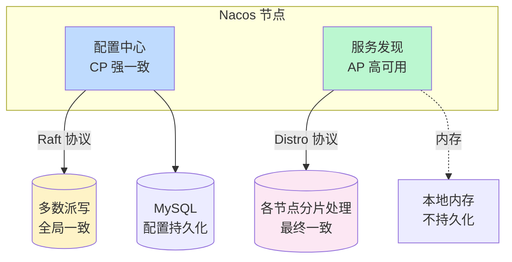
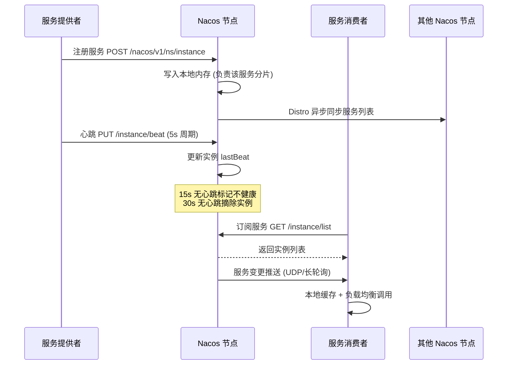

# 中间件 Nacos · 面经

## 核心问题
1. Nacos 的双协议架构是什么？为什么配置中心用 Raft，服务发现用 Distro？
2. Nacos 集群怎么部署？数据怎么持久化？节点宕机怎么处理？
3. Nacos 服务注册发现原理？健康检查怎么做？和 Eureka/Consul 怎么对比？

## 答题要点

### 双协议架构（Nacos 核心设计）

Nacos 同时承担"配置中心"和"服务发现"两个职责，两个职责对一致性和可用性的需求不同，Nacos 用双协议分别处理，这是它和 Eureka/Consul 的核心差异。



**为什么配置中心用 CP（Raft）**：
- 配置是"全局事实"，所有节点读到的配置必须一致，否则不同实例用不同配置导致行为分裂。
- 配置变更低频，强一致的性能代价可接受。
- Raft 保证：写入需多数派确认，Leader 选举需多数派投票，数据强一致。

**为什么服务发现用 AP（Distro）**：
- 服务发现高频读写（实例上下线频繁），强一致性能开销大。
- 注册中心短暂不一致（如某节点未及时收到新实例）可接受，业务侧重试或负载均衡兜底。
- 可用性优先：注册中心挂了比"数据不一致"更致命（服务无法注册发现）。
- Distro 协议：每个节点负责一部分服务的注册数据（按 hash 分片），节点间异步同步各自负责的数据，最终一致。

**对比 Eureka 的 AP**：Eureka 纯 AP，只有服务发现无配置中心，集群间全部 Peer-to-Peer 复制。Nacos 的 Distro 借鉴了 Eureka 的 AP 思想但做了分片优化（Eureka 是全量复制，Nacos 是按服务分片，节点多时更高效）。

### 集群部署与持久化

```mermaid
flowchart TB
    subgraph Nacos 集群 3 节点
        N1[Nacos 1<br/>Leader 配置中心]
        N2[Nacos 2<br/>Follower]
        N3[Nacos 3<br/>Follower]
        N1 <-.|Raft 选主| N2
        N1 <-.|Raft| N3
        N1 -->|配置写入| DB[(MySQL<br/>cluster.conf)]
        N2 --> DB
        N3 --> DB
    end
    subgraph Distro 服务发现
        N1 -->|负责服务 A B| S1[服务列表]
        N2 -->|负责服务 C D| S2[服务列表]
        N3 -->|负责服务 E F| S3[服务列表]
        N1 <-.|异步同步| N2
        N2 <-.|异步同步| N3
        N1 <-.|异步同步| N3
    end
    style N1 fill:#bfdbfe
    style DB fill:#fef3c7
```

**集群部署要点**：
- 节点数：≥3 奇数（Raft 多数派要求），推荐 3 或 5。
- `cluster.conf`：配置所有节点 IP:PORT，节点间通过此文件发现彼此。
- **MySQL 持久化**：配置数据存 MySQL（`config_info` 表等），所有节点共享同一 MySQL。MySQL 需高可用（主从/RDS）。
- **服务发现数据不持久化**：服务实例数据在内存，节点重启后从其他节点同步 + 客户端重新注册。

**节点宕机处理**：
| 角色 | 宕机影响 | 恢复机制 |
|------|---------|---------|
| Leader（配置中心） | 配置写入受阻，读仍可用 | Raft 选举新 Leader（秒级），需多数派存活 |
| Follower（配置中心） | 无影响（剩余多数派仍可写） | 重启后从 Leader 同步日志 |
| 单节点（服务发现） | 该节点负责的服务列表暂不可查 | 客户端切换其他节点，Distro 异步同步补齐 |
| 多数派宕机 | 配置中心不可写，服务发现仍可用（AP） | 恢复节点后 Raft 重建 |

**关键参数**：
- `nacos.naming.empty-service.auto-clean=false`：空服务不自动清理（默认 false，避免误删）。
- `nacos.core.protocol.raft.data.request_timeout_ms=5000`：Raft 请求超时。
- `nacos.naming.health-check.task.expiry-time=30000`：健康检查超时，30 秒未心跳标记不健康。

### 服务注册发现与健康检查



**服务注册流程**：
1. 提供者启动，向 Nacos 发送注册请求（服务名 + IP + 端口 + 元数据）。
2. Nacos 接收请求的节点成为该服务的"负责节点"（Distro 分片），写入本地内存。
3. 异步同步给其他节点（Distro 协议），最终所有节点都有完整服务列表。
4. 客户端 SDK 启动时订阅服务，Nacos 返回实例列表 + 后续变更推送。

**健康检查两种模式**：
- **客户端心跳模式**（临时实例，默认）：提供者每 5 秒发心跳，15 秒无心跳标记不健康，30 秒无心跳摘除。适合微服务场景（实例生命周期短）。
- **服务端主动探测模式**（持久实例）：Nacos 主动 TCP/HTTP 探测实例健康状态，实例下线不摘除（只标记不健康）。适合数据库、缓存等基础设施（不应因心跳断就摘除）。

**服务变更推送**：
- **UDP 推送**（1.x 默认）：Nacos 向客户端 UDP 推送变更，轻量但不可靠（UDP 可能丢包）。
- **长轮询**（2.x 默认）：客户端发起长轮询，Nacos 有变更时返回，无变更则 30 秒超时返回。可靠但连接开销大。
- **gRPC 长连接**（2.x+）：双向流，实时推送，2.x 推荐方式。

**客户端容错**：
- 本地缓存服务列表（`failover` 文件），Nacos 不可用时用本地缓存调用。
- 订阅失败自动重试，切换 Nacos 节点。

### Nacos vs Eureka vs Consul

| 维度 | Nacos | Eureka | Consul |
|------|-------|--------|--------|
| 一致性 | 配置 CP + 发现 AP（双协议） | 纯 AP | CP（Raft） |
| 配置中心 | 原生支持 | 不支持 | KV 存储可做 |
| 健康检查 | 心跳 + 主动探测 | 心跳 | 丰富的探测（TCP/HTTP/Script） |
| 多数据中心 | 支持（通过 namespace） | 需要额外方案 | 原生支持 |
| 协议 | HTTP + gRPC | HTTP | HTTP + gRPC |
| 生态 | 阿里云原生 + Spring Cloud Alibaba | Spring Cloud Netflix（停更） | HashiCorp 生态 |
| 语言 | Java | Java | Go |
| 控制台 | 自带 | 简单 | 自带 UI |

**选型建议**：
- 阿里系/Spring Cloud Alibaba：Nacos 一站式（配置 + 发现）。
- 纯服务发现 + 已用 Spring Cloud：Eureka（但已停更，新项目不推荐）。
- 多数据中心 + 强一致 + 丰富健康检查：Consul。
- K8s 原生：直接用 K8s Service + ConfigMap，无需额外注册中心。

## 加分回答

Nacos 的双协议是它最精妙的设计，也是面试加分点。很多人只知道"Nacos 是注册中心"，不清楚它内部跑着两套完全不同的协议。配置中心跑 Raft（CP），因为配置是全局事实，必须强一致--想象一下，如果 3 个 Nacos 节点对"数据库连接串"的配置不一致，不同服务实例连不同数据库，数据就乱了。服务发现跑 Distro（AP），因为注册中心短暂不一致可接受--某节点未及时收到新实例，消费者少调一个实例，重试或负载均衡就兜底了，但注册中心不可用则所有服务无法发现，影响面更大。这是 CAP 理论的务实应用：不同业务对 C 和 A 的需求不同，强行统一用 CP 或 AP 都是次优解。Eureka 纯 AP 导致配置中心做不了，Consul 纯 CP 导致服务发现性能差，Nacos 的双协议是"成年人全都要"的工程智慧。

Nacos 2.x 的 gRPC 长连接是被低估的改进。1.x 用 HTTP 短连接 + UDP 推送，问题多：每次注册/查询都建 HTTP 连接开销大，UDP 推送不可靠会丢消息导致客户端服务列表过期。2.x 改用 gRPC 长连接，客户端与 Nacos 节点保持一条长连接，注册/查询/推送都走这条连接，性能提升 3-5 倍，推送可靠性从 UDP 升级为流式推送。但长连接带来新挑战：连接管理（心跳保活、断线重连）、负载均衡（连接不能全集中在一个节点）、Nacos 节点滚动升级时连接迁移。生产升级 2.x 要灰度，先升级 Nacos 服务端再升级客户端 SDK，避免协议不兼容。一个真实教训：某团队直接升级 Nacos 2.x 但客户端 SDK 还是 1.x，导致服务发现间歇性失败，回滚后才定位是协议不兼容。

## 口播版短文案

Nacos 双协议是核心：配置中心跑 Raft 强一致，因为配置是全局事实不一致就乱套；服务发现跑 Distro 高可用，因为注册中心挂了比短暂不一致更致命，AP 优先。这是 CAP 的务实应用，Eureka 纯 AP 做不了配置中心，Consul 纯 CP 服务发现性能差，Nacos 成年人全都要。集群 3 节点奇数起步，配置存 MySQL 共享，服务发现数据在内存不持久化。Leader 挂了 Raft 秒级选新，多数派存活就能写。服务注册：提供者发注册请求，Nacos 分片负责，Distro 异步同步给其他节点。健康检查两种：临时实例客户端 5 秒心跳，15 秒标记不健康 30 秒摘除；持久实例服务端主动探测，下线不摘除只标记。2.x 用 gRPC 长连接替代 1.x 的 HTTP 加 UDP，性能提升 3 到 5 倍推送可靠。选型：阿里系用 Nacos 一站式，多数据中心用 Consul，K8s 原生直接用 Service 加 ConfigMap。

## 标签
Nacos, 双协议, Raft, Distro, 服务发现, 配置中心, 健康检查, 运维面试
