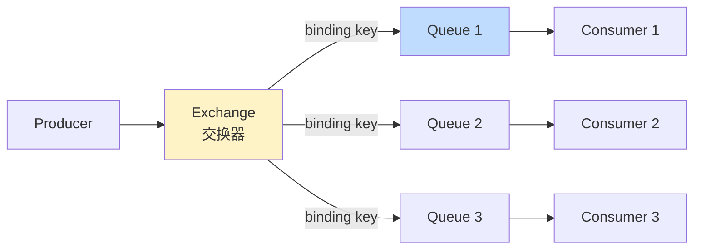
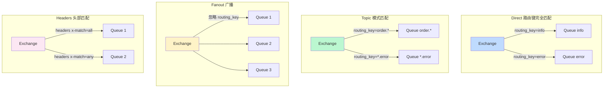
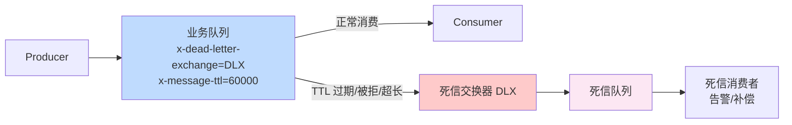
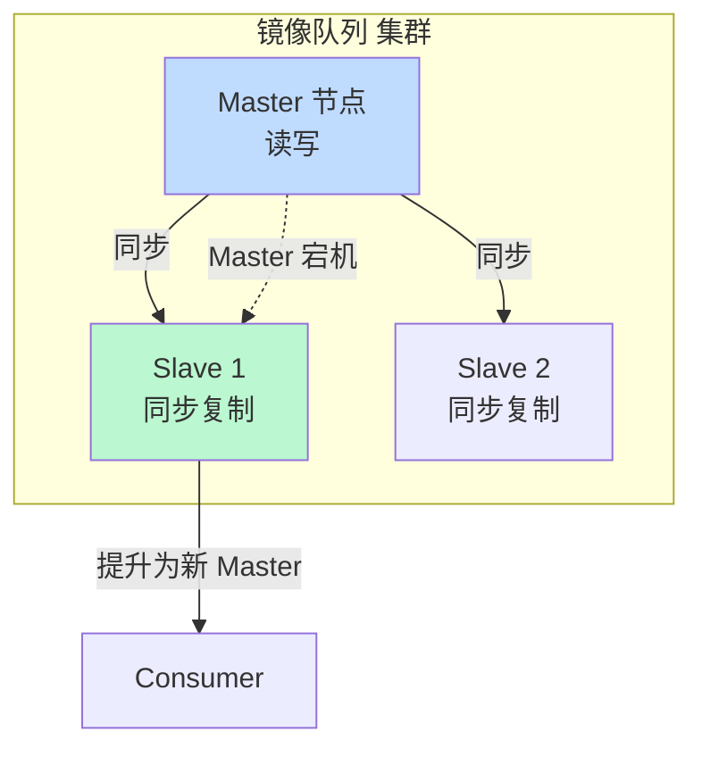

# 中间件 RabbitMQ · 面经

## 核心问题
1. RabbitMQ 的交换器类型有哪些？路由机制怎么工作？
2. RabbitMQ 怎么保证消息不丢？生产者确认、持久化、ACK 机制怎么配合？
3. RabbitMQ 死信队列和延迟队列怎么实现？和 Kafka 怎么选型？

## 答题要点

### AMQP 模型与交换器类型

RabbitMQ 基于 AMQP 0.9.1 协议，核心模型是 `Producer -> Exchange -> Queue -> Consumer`，Exchange 根据 binding 规则把消息路由到 Queue。



四种交换器类型：



| 交换器类型 | 路由规则 | 适用场景 | 示例 |
|-----------|---------|---------|------|
| **Direct** | routing key 完全匹配 binding key | 点对点，按类型分发 | `error` -> 错误队列，`info` -> 日志队列 |
| **Topic** | routing key 按 `*`（单词）/`#`（多词）模式匹配 | 灵活路由，层级分类 | `order.*` 匹配 `order.create`/`order.pay` |
| **Fanout** | 忽略 routing key，广播到所有绑定队列 | 广播通知，多消费者各处理一份 | 配置变更通知所有节点 |
| **Headers** | 根据 headers 属性匹配（不依赖 routing key） | 复杂条件路由 | `x-match=all` 所有 header 匹配 |

**routing key 格式**：点分隔的单词，如 `order.create.paid`。Topic 模式下 `*` 匹配一个单词，`#` 匹配零或多个单词。

### 消息可靠性三道防线

```mermaid
flowchart LR
    subgraph ① 生产者到 MQ
        P[Producer] -->|confirm 模式| EX[Exchange]
        EX -->|ACK/NACK| P
    end
    subgraph ② MQ 持久化
        EX -->|durable=true| Q[Queue<br/>持久化]
        Q -->|delivery_mode=2| D[(磁盘]
    end
    subgraph ③ MQ 到消费者
        Q -->|push| C[Consumer]
        C -->|basic.ack| Q
        C -->|basic.nack requeue| Q
    end
    style P fill:#fef3c7
    style Q fill:#bfdbfe
    style C fill:#bbf7d0
```

**① 生产者确认（Publisher Confirm）**：
- 开启 confirm 模式：`channel.confirmSelect()`。
- 消息发送后，MQ 返回 `ack`（已收到并持久化）或 `nack`（未收到）。
- 两种模式：
  - **同步确认**：每发一条等一个 ack，性能差但可靠。
  - **异步确认**：批量发送，异步回调 ack/nack，性能好，生产推荐。
- 生产者收到 nack 后重发，保证消息不丢。

**② 队列与消息持久化**：
- 队列声明 `durable=true`：队列元数据持久化，MQ 重启后队列还在。
- 消息发送 `delivery_mode=2`（Persistent）：消息持久化到磁盘，重启不丢。
- 两者必须同时开启，缺一不可（队列不持久化，重启后队列没了消息也无从附着）。

**③ 消费者手动 ACK**：
- 关闭自动确认：`channel.basicConsume(queue, autoAck=false)`。
- 消费者处理完成后 `basic.ack`，处理失败 `basic.nack`（可选 `requeue=true` 重新入队）。
- 未 ack 的消息，消费者断开后 MQ 重新投递给其他消费者。
- 注意：`autoAck=true` 时消息一投递就确认，消费者处理失败消息就丢了，生产禁用。

**三道防线配合**：生产者 confirm 保证消息到 MQ，MQ 持久化保证重启不丢，消费者手动 ACK 保证处理成功才确认。全开才能保证"至少一次"（at-least-once）投递。

**幂等性**：at-least-once 意味着可能重复投递（消费者 ack 丢失会重投），消费者必须幂等。常见方案：业务唯一键去重（数据库唯一索引/Redis SETNX）。

### 死信队列与延迟队列

**死信（Dead Letter）触发条件**：
1. 消息被 `basic.nack`/`basic.reject` 且 `requeue=false`。
2. 消息 TTL 过期。
3. 队列达到最大长度（`x-max-length`）。

**死信队列实现**：给业务队列绑定 `x-dead-letter-exchange` 参数，消息成为死信后自动转发到指定 DLX。



**延迟队列实现**（RabbitMQ 无原生延迟队列，靠 TTL + DLX 模拟）：
```
# 伪配置
业务队列: x-message-ttl=60000 (60秒过期)
          x-dead-letter-exchange=delay_dlx
死信交换器: delay_dlx (direct)
死信队列: 绑定 delay_dlx
# 消息进业务队列后 60 秒过期 -> 转发到 DLX -> 进死信队列 -> 消费者消费
```

**延迟队列的坑--队头阻塞**：
- RabbitMQ 队列是 FIFO，TTL 检查从队头开始。
- 如果队头消息 TTL 是 60 秒，队尾消息 TTL 是 10 秒，队尾消息要等队头过期后才会被检查，导致"10 秒延迟"变成"60 秒延迟"。
- 解决方案：用 `rabbitmq_delayed_message_exchange` 插件（基于 heap 实现按过期时间排序），避免队头阻塞。

### 与 Kafka 选型对比

| 维度 | RabbitMQ | Kafka |
|------|---------|-------|
| 设计目标 | 消息路由 + 可靠投递 | 高吞吐日志流 |
| 吞吐量 | 万级 TPS | 百万级 QPS |
| 延迟 | 微秒级 | 毫秒级 |
| 消息模型 | 队列 + 交换器（丰富路由） | 分区 + 消费组（简单） |
| 消息持久化 | 支持（磁盘） | 默认持久化（磁盘） |
| 消息回溯 | 不支持（消费即删） | 支持（offset 任意位置） |
| 消费者模式 | Push（推） | Pull（拉） |
| 路由灵活性 | 极强（4 种交换器） | 弱（按 topic 分区） |
| 适用场景 | 复杂路由、强可靠、业务消息 | 日志流、事件溯源、大数据 |

**选型建议**：
- 业务消息（订单、支付、通知）+ 复杂路由 + 强可靠：RabbitMQ。
- 日志/事件流 + 高吞吐 + 长期存储：Kafka。
- 都需要：双写（RabbitMQ 做业务，Kafka 做日志/分析）。

### 镜像队列与高可用



- **经典镜像队列**（3.8 前）：`ha-mode=all`/`exactly`/`nodes`，Master 挂了 Slave 提升。同步复制有性能开销。
- **Quorum Queue**（3.8+ 推荐）：基于 Raft 协议，强一致 + 自动故障转移，替代经典镜像队列。`x-queue-type=quorum` 声明。
- 生产推荐 Quorum Queue，经典镜像队列已标记 deprecated。

## 加分回答

RabbitMQ 的可靠性是它被金融和电商场景青睐的核心，但"全开可靠性"的性能代价常被低估。生产者 confirm + 持久化 + 消费者手动 ACK 全开后，RabbitMQ 的 TPS 可能从 5 万降到 1 万以下。原因是 confirm 要等 MQ 持久化磁盘后才能 ack，磁盘 fsync 是性能瓶颈。生产优化：用异步 confirm 批量发送（攒 100 条等一个 ack 批次）；持久化用 SSD 提升 fsync 速度；消费者 prefetch 设合理值（如 10-50），太小吞吐低，太大内存压力。极致场景可降级：非关键消息关闭持久化（`delivery_mode=1`），换 5-10 倍吞吐。判断标准：金融订单全开可靠性，日志通知可降级。一个常见误区是"所有消息都全开可靠性"，结果 TPS 上不去只能堆机器，其实是没做消息分级。

RabbitMQ 的延迟队列是面试高频但实践暗坑多。TTL + DLX 方案的最大坑是"队头阻塞"--FIFO 队列的 TTL 检查从队头开始，队头消息 TTL 长，后面短 TTL 消息被阻塞。比如先发 60 秒延迟消息再发 10 秒延迟消息，10 秒消息要等 60 秒消息过期后才被处理，实际延迟 60 秒而非 10 秒。解决方案有三个：一是 `rabbitmq_delayed_message_exchange` 插件（基于 heap 按过期时间排序，无队头阻塞），生产推荐；二是为不同延迟级别建不同队列（10s/30s/60s/5min 各一个），消息按延迟级别路由，避免混队；三是用 Redis ZSet 做延迟队列（score=过期时间，定时扫描），轻量但不适合大规模。真实教训：某团队用 TTL+DLX 做订单超时取消，结果延迟 30 分钟的消息被延迟 5 分钟的消息阻塞，订单超时取消延迟到几小时，被用户投诉。

## 口播版短文案

RabbitMQ 核心是 AMQP 模型：Producer 发 Exchange，Exchange 按 binding 规则路由到 Queue，Consumer 从 Queue 消费。四种交换器：Direct 路由键完全匹配点对点，Topic 模式匹配星号匹配一个词井号匹配多词，Fanout 广播忽略路由键，Headers 按头部属性匹配。可靠性三道防线必须全开：生产者 confirm 模式异步等 MQ ack，队列和消息都持久化 durable 加 delivery_mode=2，消费者手动 ACK 处理完才确认。全开能保证 at-least-once 但 TPS 从 5 万降到 1 万，所以要做消息分级，金融订单全开日志通知可降级。死信队列三种触发：消息被拒 requeue=false、TTL 过期、队列超长。延迟队列靠 TTL 加 DLX 实现但有队头阻塞坑，不同延迟消息混队会导致短延迟被长延迟阻塞，解法用 delayed_message_exchange 插件或按延迟级别分队列。和 Kafka 选型：RabbitMQ 适合业务消息复杂路由强可靠万级 TPS，Kafka 适合日志流高吞吐百万 QPS。高可用用 Quorum Queue 基于 Raft 替代经典镜像队列。

## 标签
RabbitMQ, AMQP, 交换器, 消息可靠性, 死信队列, 延迟队列, Quorum Queue, 运维面试
