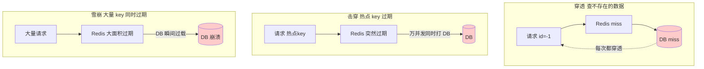
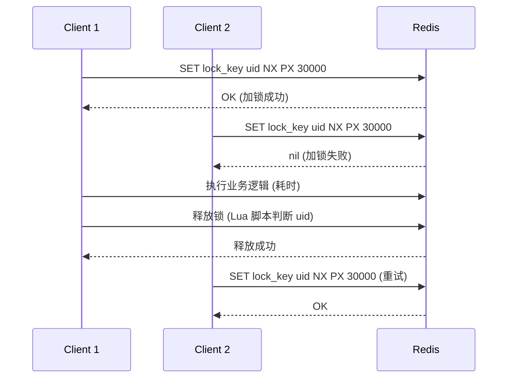
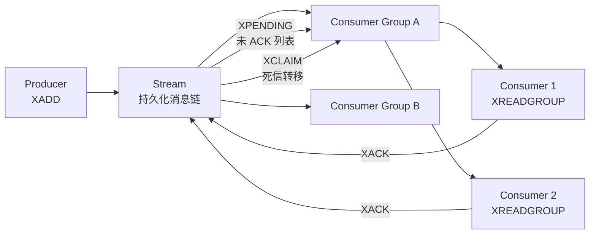

# 中间件 Redis · 面经

## 核心问题
1. Redis 作为缓存，缓存穿透 / 击穿 / 雪崩怎么解决？
2. Redis 分布式锁怎么实现？Redisson 的看门狗机制是什么？
3. Redis 作为消息队列，List / Pub-Sub / Stream 怎么选？

## 答题要点

### 缓存穿透 / 击穿 / 雪崩



| 问题 | 本质 | 危害 | 解决方案 |
|------|------|------|---------|
| **穿透** | 查询不存在的数据，缓存永不命中 | 恶意攻击或 bug 导致 DB 被打 | ① 缓存空值（NULL，设短 TTL 如 60s）② 布隆过滤器前置拦截（存在才查 DB）③ 接口层参数校验 |
| **击穿** | 热点 key 过期瞬间，万并发同时查 DB | DB 瞬时压力骤增 | ① 互斥锁（setnx 加锁，只让一个请求查 DB 回写）② 热点 key 永不过期 + 异步更新 ③ 逻辑过期（value 带过期时间，过期后异步刷新） |
| **雪崩** | 大量 key 同时过期或 Redis 宕机 | DB 被雪崩流量打垮 | ① TTL 加随机抖动（如 `ttl + random(60)`）② 多级缓存（本地 Caffeine + Redis）③ Redis 高可用集群 ④ 服务降级限流兜底 |

**互斥锁防击穿示例**：
```
# 伪代码
value = redis.get(key)
if value == nil:
    if redis.setnx(lock_key, "1", ttl=10s):  # 加锁成功
        value = db.query(key)
        redis.set(key, value, ttl=300s)
        redis.del(lock_key)
        return value
    else:  # 加锁失败，等待后重试
        sleep(50ms)
        return get(key)  # 递归重试
```

**布隆过滤器防穿透**：
- 启动时把所有合法 ID 加载到布隆过滤器。
- 查询时先过布隆过滤器：不存在直接返回（拦截穿透），存在再查 Redis/DB。
- 误判率可控（bit 数组大小 + hash 函数个数），1 亿 ID 约 100MB 内存，误判率 0.01%。

### Redis 分布式锁



**基础分布式锁三要素**：
1. **加锁原子性**：`SET key value NX PX 30000`（NX 不存在才设 + PX 过期毫秒），一条命令保证原子。
2. **value 唯一标识**：value 必须是客户端唯一 ID（如 UUID），防止 A 超时后 B 加锁，A 又 DEL 释放了 B 的锁。
3. **释放锁原子性**：用 Lua 脚本"判断 value + DEL"原子执行，避免判断后 DEL 前锁被别人拿走。

**Lua 释放锁脚本**：
```lua
if redis.call("get", KEYS[1]) == ARGV[1] then
    return redis.call("del", KEYS[1])
else
    return 0
end
```

**Redisson 看门狗机制**：
- 问题：业务执行时间不可预估，锁 TTL 设短了业务没完锁被释放，设长了宕机恢复慢。
- 解决：Redisson 看门狗（Watchdog）自动续期。
- 原理：加锁默认 TTL 30 秒，后台线程每 10 秒（1/3 TTL）检查锁还持有就续期到 30 秒，业务完成后停止续期。
- 代码：`lock.lock()` 默认开启看门狗；`lock.lock(10, TimeUnit.SECONDS)` 指定 TTL 时不开启看门狗（无法续期）。

**RedLock 算法（多节点锁）**：
- 问题：单 Redis 主从切换可能丢锁（Master 加锁后未同步到 Slave 就宕机，Slave 升主后锁丢失）。
- RedLock：向 N（奇数，通常 5）个独立 Redis 实例加锁，超过半数（N/2+1）成功且耗时小于 TTL，则加锁成功。
- 争议：Martin Kleppmann 批评 RedLock 在时钟漂移和 GC 暂停场景不安全，生产强一致场景建议用 ZooKeeper/etcd。

**生产建议**：
- 大部分场景：单 Redis + Redisson 足够（看门狗 + 可重入 + 公平锁）。
- 强一致 + 容忍复杂度：ZooKeeper / etcd 分布式锁（基于 Paxos/Raft）。
- RedLock：争议大，Redis 官方推荐但社区有分歧，慎用。

### Redis 消息队列选型

| 方案 | 数据结构 | 持久化 | 消费确认 | 消费组 | 适用场景 |
|------|---------|--------|---------|--------|---------|
| List + LPUSH/BRPOP | List | 是（AOF） | 无（POP 即消费） | 不支持 | 简单队列，容忍丢消息 |
| Pub/Sub | 频道 | 否（不持久） | 无 | 不支持 | 实时广播，离线消息丢 |
| Stream | Stream | 是 | 是（XACK） | 支持 | 可靠队列，多消费者组 |

**List 队列**：
```
生产者: LPUSH queue msg
消费者: BRPOP queue 0  # 阻塞式弹出
```
- 缺点：无消费确认，消费者 POP 后崩溃消息丢；无多消费者组（一条消息只能被一个消费者消费）。

**Pub/Sub**：
```
订阅者: SUBSCRIBE channel
发布者: PUBLISH channel msg
```
- 缺点：消息不持久，订阅者离线期间的消息全丢；无消费确认。

**Stream（5.0+，推荐）**：


- **XADD** 生产消息，自带 ID（时间戳+序号），持久化。
- **XREADGROUP** 消费组消费，每条消息进 PEL（Pending Entries List）等 ACK。
- **XACK** 确认消费，从 PEL 移除；未 ACK 的消息可被 **XCLAIM** 转移给其他消费者（处理消费者宕机）。
- **消费者组**：多个消费者组独立消费同一 Stream，互不影响（类似 Kafka 消费组）。
- ** maxlen** 限制 Stream 长度，如 `XADD stream MAXLEN 10000 * field value`，防止无限增长。

**Redis 做消息队列 vs Kafka/RabbitMQ**：
- Redis Stream 适合：轻量场景、已有 Redis、消息量不大（< 10万 QPS）、容忍偶尔丢消息。
- Kafka：高吞吐（百万 QPS）、日志/事件流、强顺序、长时间存储。
- RabbitMQ：复杂路由、强可靠性、消息确认完善、TPS 中等。

## 加分回答

缓存三大问题是面试必问，但很多人只背概念不深究。穿透的本质是"查询的数据根本不存在，缓存无法填充"，布隆过滤器是治本方案但要权衡：布隆过滤器要预加载所有合法 key，数据量大时初始化慢（1 亿 key 加载几分钟），且新增数据要同步更新布隆过滤器，否则新数据被误判不存在。生产折中方案：对确定性 ID（如手机号、订单号格式）做正则校验 + 布隆过滤器；对不确定性 ID 只缓存空值。击穿的"永不过期"方案被低估：所谓"永不过期"不是真的不设 TTL，而是 value 里带逻辑过期时间，查询时判断逻辑过期则异步刷新，同步返回旧数据。这样热点 key 永远不会被 DB 直击，代价是短暂返回旧数据（最终一致）。雪崩的 TTL 抖动是标配但常被忘：`expire key 300 + random(60)`，把大量同时写入的 key 的过期时间打散，避免集体过期。

分布式锁是 Redis 中间件用法的"深水区"。基础版 `SET NX PX` + Lua 释放能覆盖 80% 场景，但有三个暗坑：坑一是锁超时业务没执行完，锁被别人拿走导致并发--Redisson 看门狗解决，但要记得别用 `lock(10s)` 指定 TTL（会关闭看门狗）。坑二是主从切换丢锁，Master 加锁后未同步到 Slave 就宕机，Slave 升主后锁消失--这是单 Redis 锁的固有缺陷，强一致场景用 ZK/etcd。坑三是可重入锁的实现：Redisson 用 Hash 结构存 `{thread_id: count}`，同线程多次加锁 count+1，释放 count-1，count=0 才删 key。很多人不知道可重入原理，面试被追问就露馅。生产建议：非金融场景用 Redisson 单节点锁 + 看门狗；金融强一致用 ZK/etcd；跨数据中心用 RedLock（理解风险后用）。

Redis Stream 是被低估的能力，很多人还在用 List 做队列。Stream 相比 List 有三大优势：持久化（AOF/RDB 保护）、消费确认（XACK 保证 at-least-once）、消费者组（多消费组独立消费）。但 Redis 做队列有天花板：单实例 Stream 的吞吐受 Redis 单线程限制（< 10万 QPS），超过就上 Kafka；Redis 的消息存储不适合长时间保留（内存贵），Kafka 能存 TB 级。选型标准很简单：消息量 < 10万 QPS + 已有 Redis + 不需长时间存储，用 Stream；否则上 Kafka。一个常见误区是用 Redis Stream 做订单队列，结果订单数据要保留 30 天，内存爆了。这种场景 Kafka 才是正解--磁盘存储成本低两个数量级。

## 口播版短文案

缓存三大问题：穿透是查不存在的数据缓存永不命中，解决缓存空值或布隆过滤器前置；击穿是热点 key 过期万并发打 DB，解决互斥锁或逻辑过期；雪崩是大量 key 同时过期，解决 TTL 加随机抖动加多级缓存。分布式锁三要素：SET NX PX 原子加锁、value 唯一 ID 防误删、Lua 脚本原子释放。Redisson 看门狗默认 30 秒 TTL 每 10 秒续期，但指定 TTL 会关闭看门狗别踩坑。主从切换丢锁是单 Redis 固有缺陷，强一致用 ZK 或 etcd。消息队列三方案：List 简单但无确认无消费组，Pub-Sub 实时广播但不持久，Stream 5.0 加持持久化加 XACK 加消费组是推荐方案。选型标准：消息量小于 10 万 QPS 加已有 Redis 用 Stream，超过就上 Kafka。别用 Redis Stream 存要长期保留的数据，内存比磁盘贵两个数量级，订单要存 30 天这种场景 Kafka 才正解。

## 标签
Redis, 缓存穿透, 分布式锁, Redisson, 看门狗, RedLock, Redis Stream, 运维面试
